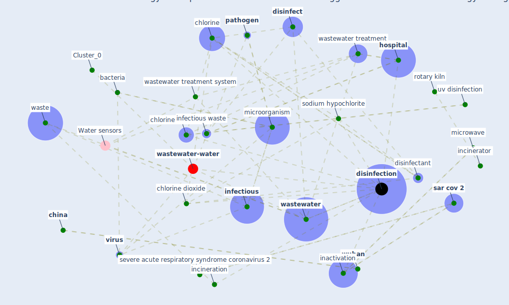

# Article: Disinfection technology of hospital wastes and wastewater: Suggestions for disinfection strategy during coronavirus Disease 2019 (COVID-19) pandemic in China (wang_disinfection_2020)

* Source: [10.1016/j.envpol.2020.114665](https://doi.org/10.1016/j.envpol.2020.114665)
* Year: 2020
* Cluster: [wastewater-water](cluster_0)

## Keywords

 * I c l e, airborne transmission, [bacteria](keyword_bacteria), biochem, biotechnol, cern, [china](keyword_china), chlorination, [chlorine](keyword_chlorine), [chlorine dioxide](keyword_chlorine_dioxide), chlorine disinfection, contr, [coronavirus](keyword_coronavirus), covid 19 pandemic in china, dioxin, disadvantage, discharge, [disease](keyword_disease), [disinfect](keyword_disinfect), [disinfectant](keyword_disinfectant), [disinfection](keyword_disinfection), disinfection technology, disposal, dose system, drainage system, electromagnetic wave, environ china, [environment](keyword_environment), enzyme, feder, haikou, hazard, hazard mater, hclo, [health care](keyword_health_care), high temperature steam disinfection, [hospital](keyword_hospital), [hubei](keyword_hubei), [impact](keyword_impact), inactivation, incineration, incinerator, [infection](keyword_infection), [infectious](keyword_infectious), infectious waste, [italy](keyword_italy), kiln, landfill, [mater](keyword_mater), [microorganism](keyword_microorganism), microwave, molecule, occupation, ozone, [pathogen](keyword_pathogen), pharmaceutical, pipe, plasma incineration, [pollutant](keyword_pollutant), [pollution](keyword_pollution), protein, purification tank, pyrolysis, pyrolysis vaporization incinerator, radioactive waste, rotary kiln, rotary kiln incinerator, [sar cov 2](keyword_sar_cov_2), secondary combustion chamber, secondary pollution, sedimentation tank, septic tank, severe acute respiratory syndrome coronavirus 2, sludge, sodium hypochlorite, sodium hypochlorite disinfection, sodium hypochlorite generator, solid waste, [switzerland](keyword_switzerland), [transmission](keyword_transmission), transmission route, [treatment](keyword_treatment), [ultraviolet](keyword_ultraviolet), ultraviolet b, ultraviolet c, [united states](keyword_united_states), uv disinfection, [virus](keyword_virus), [ward](keyword_ward), waste, waste disposal, waste manag, [wastewater](keyword_wastewater), wastewater pump, wastewater treatment, wastewater treatment system, [water](keyword_water), waveband, [wuhan](keyword_wuhan), flammable gas

## Concepts

 

## Neighbours

### Closest articles

* Indirect effects of COVID-19 on the environment - [LINK](article_zambrano-monserrate_indirect_2020)
* Nurture to nature via COVID-19, a self-regenerating environmental strategy of environment in global context - [LINK](article_paital_nurture_2020)
* Air pollution linked with higher COVID-19 death rates - [LINK](article_harvard_th_chan_schoold_of_public_health_air_2020)
* COVID-19 Higher Mortality in Chinese Regions With Chronic Exposure to Lower Air Quality - [LINK](article_pansini_covid-19_2021)
* Seeing the invisible hand: Underlying effects of COVID-19 on tourists’ behavioral patterns - [LINK](article_li_seeing_2020)
* Should I Stay or Should I Go? Tourists’ COVID-19 Risk Perception and Vacation Behavior Shift - [LINK](article_bratic_should_2021)
* Biophilic design in architecture and its contributions to health, well-being, and sustainability: A critical review - [LINK](article_zhong_biophilic_2022)
* The socio-economic implications of the coronavirus pandemic (COVID-19): A review - [LINK](article_nicola_socio-economic_2020)
* COVID-19 could be a seasonal illness with higher risk in winter: Reduced humidity linked to increased COVID-19 risk - [LINK](article_university_of_sydney_covid-19_2020)

### Closest BPs

* Blueprint: Resilience in staffing and skills training - [LINK](bp_12)
* Blueprint: Installing UV in ductwork - [LINK](bp_10)
* Blueprint: Negative pressure rooms - [LINK](bp_13)
