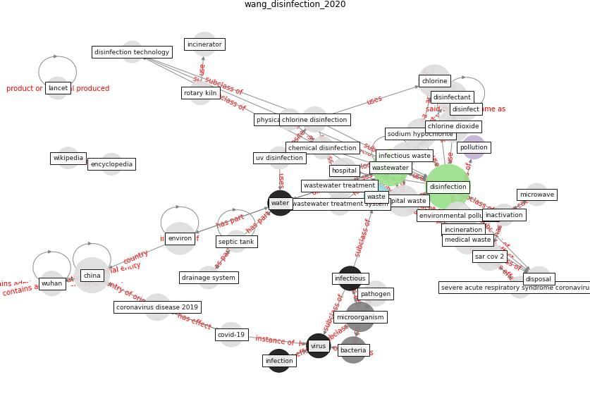

# Article: __Disinfection technology of hospital wastes and wastewater: Suggestions for disinfection strategy during coronavirus Disease 2019 (COVID-19) pandemic in China__ (wang_disinfection_2020)

* [10.1016/j.envpol.2020.114665](https://doi.org/10.1016/j.envpol.2020.114665)
* Cluster: [water-wastewater](cluster_15)

## Keywords

* [disinfection](keyword_disinfection), [wastewater](keyword_wastewater), [china](keyword_china), [chlorine](keyword_chlorine), [chlorine dioxide](keyword_chlorine_dioxide), [environ](keyword_environ), [hospital waste](keyword_hospital_waste), [disinfectant](keyword_disinfectant), [sodium hypochlorite](keyword_sodium_hypochlorite), [microorganism](keyword_microorganism), incineration, medical waste, [sar cov 2](keyword_sar_cov_2), wastewater treatment, environmental pollution

## Keywords at large

* [biophilic design](keyword_biophilic_design), [architecture](keyword_architecture), [sustainable architecture](keyword_sustainable_architecture), [nature](keyword_nature), [design](keyword_design), [biophilic](keyword_biophilic), [environ](keyword_environ), [biophilia](keyword_biophilia), [wellbeing](keyword_wellbeing), [health](keyword_health)

## Concepts

 

### References 

* [Air, Surface Environmental, and Personal
Protective Equipment Contamination by Severe
Acute Respiratory Syndrome Coronavirus 2
(SARS-CoV-2) From a Symptomatic Patient](article_ong_air_2020)

### Cited by 

* [When the fourth water and digital revolution encountered
COVID-19](article_poch_when_2020)
