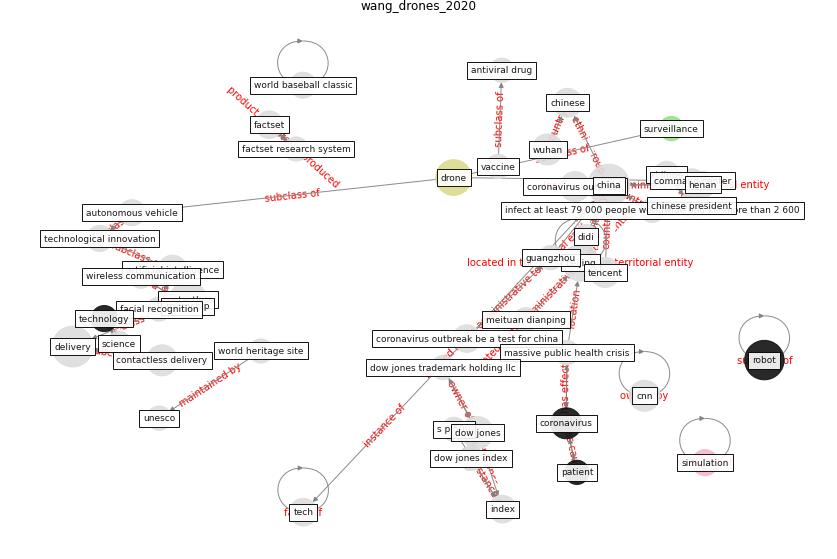

# Article: __Drones. Disinfecting robots. Supercomputers. The coronavirus outbreak is a test for China's tech industry \textbar CNN Business__ (wang_drones_2020)

* URL: [https://www.cnn.com/2020/02/23/tech/china-tech-coronavirus-outbreak/index.html](https://www.cnn.com/2020/02/23/tech/china-tech-coronavirus-outbreak/index.html)
* Year: 2020
* Abstract: China has spent decades nurturing its tech sector. Now,
faced with a massive public health crisis, Beijing is
pushing its tech companies to join the fight against the
novel coronavirus.

## Keywords

[robot](keyword_robot), [drone](keyword_drone), [coronavirus](keyword_coronavirus)

## Concepts

 

