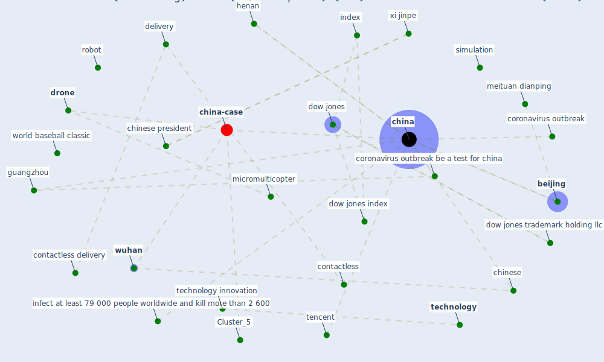

# Article: Drones. Disinfecting robots. Supercomputers. The coronavirus outbreak is a test for China's tech industry \textbar CNN Business (wang_drones_2020)

* [https://www.cnn.com/2020/02/23/tech/china-tech-coronavirus-outbreak/index.html](https://www.cnn.com/2020/02/23/tech/china-tech-coronavirus-outbreak/index.html)
* Year: 2020
* Cluster: [sociale-drone](cluster_6)

## Keywords

 * 2008 summer olympic, a massive public health crisis, autonomous driving, autonomous vehicle, [beijing](keyword_beijing), cable news network, chicago, chicago mercantile exchange inc, [china](keyword_china), [chinese](keyword_chinese), chinese president, [city](keyword_city), cnn sans, command center, [computer](keyword_computer), [contactless](keyword_contactless), contactless delivery, [coronavirus](keyword_coronavirus), [coronavirus outbreak](keyword_coronavirus_outbreak), coronavirus outbreak be a test for china, danny mu, [delivery](keyword_delivery), development of technology, didi, discovery, dow jones, dow jones index, dow jones trademark holding llc, [drone](keyword_drone), epa efe, factset, factset research system, factset research systems inc, fair value, forrester, guangzhou, henan, henan province, [human](keyword_human), human to human contact, [index](keyword_index), infect at least 79 000 people worldwide and kill more than 2 600, intensive care unit, jd com, kleiner perkin, [law](keyword_law), massive public health crisis, meituan, meituan dianping, microchip, micromulticopter, ministry of science and technology, nasa, operate room, [patient](keyword_patient), [practice](keyword_practice), regulation, ride hail, [robot](keyword_robot), s p 500, s p dow jones indices llc, science, [shanghai](keyword_shanghai), shanghai tmirob, [shenzhen](keyword_shenzhen), shutterstock, silicon valley, [simulation](keyword_simulation), situation in wuhan, space shuttle, space shuttle endeavour, stock index, super computing, super computing facility, supercomputer, [surveillance](keyword_surveillance), surveillance state, [system](keyword_system), tech company, tech ind, tech sector, [technology](keyword_technology), technology innovation, tencent, the coronavirus outbreak be a test for china, the situation, the virus, trading holiday, trading hour, tsinghua university, [unesco](keyword_unesco), venture capital, warner bros, wireless communication, world baseball classic, [world heritage site](keyword_world_heritage_site), world s 20 most valuable tech company, [wuhan](keyword_wuhan), wuhan virus, xi jinpe

## Concepts

 

## Neighbours

### Closest articles

* How drones help cities during the Covid-19 pandemic \textbar TheMayor.EU - [LINK](article_dimitrova_how_2021)
* Danish disinfection robots save lives in the fight against the Corona virus \textbar Shaping Europe’s digital future - [LINK](article_ec_views_danish_2020)
* Combating COVID-19—The role of robotics in managing public health and infectious diseases - [LINK](article_yang_combating_2020)
* Open-source analytics tools for studying the COVID-19 coronavirus outbreak - [LINK](article_wu_open-source_2020)
* Mechanistic insights into the effect of humidity on airborne influenza virus survival, transmission and incidence - [LINK](article_marr_mechanistic_2019)
* An investigation of transmission control measures during the first 50 days of the COVID-19 epidemic in China - [LINK](article_tian_investigation_2020)
* The effect of human mobility and control measures on the COVID-19 epidemic in China - [LINK](article_kraemer_effect_2020)
* How Can Blockchain Help People in the Event of Pandemics Such as the COVID-19? - [LINK](article_chang_how_2020)
* Health Information Exchange with Blockchain amid Covid-19-like Pandemics - [LINK](article_christodoulou_health_2020)

### Closest BPs

* Blueprint: Installing UV in ductwork - [LINK](bp_10)
* Blueprint: Resilience in staffing and skills training - [LINK](bp_12)
* Blueprint: Negative pressure rooms - [LINK](bp_13)
