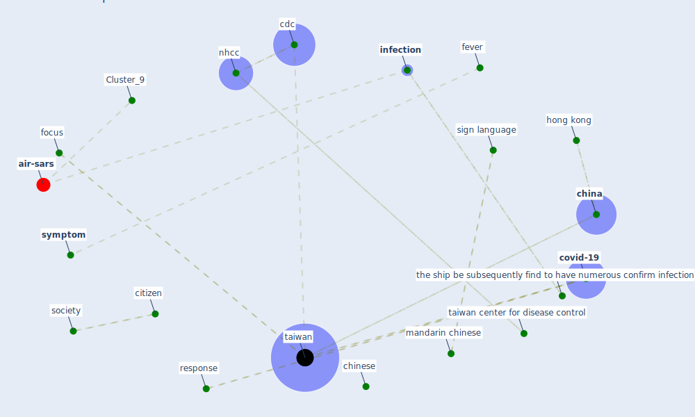

# Article: Response to COVID-19 in Taiwan (wang_response_2020)

* Source: [10.1001/jama.2020.3151](https://doi.org/10.1001/jama.2020.3151)
* Year: 2020
* Cluster: [air-sars](cluster_9)

## Keywords

 * accounting, action item, [analytic](keyword_analytic), asymptomatic, atononinvasive, autodock vina, [big datum](keyword_big_datum), budget, [cdc](keyword_cdc), center for disease control, [china](keyword_china), [chinese](keyword_chinese), citizen, [clinic](keyword_clinic), community member, concern, concern about community spread, containment, cookie policy, cough, country affect thus far, [covid-19](keyword_covid-19), [crisis](keyword_crisis), cruise ship, disaster management center, disease stigma, [drug](keyword_drug), emergency management, [engineering](keyword_engineering), [epidemic](keyword_epidemic), epidemiologist, [fever](keyword_fever), focus, [government](keyword_government), gynecology, handwash, health authority, [hong kong](keyword_hong_kong), [hospital](keyword_hospital), incidence, indinavir, [infection](keyword_infection), [influenza](keyword_influenza), inhibitor, [italy](keyword_italy), jason wang, largeoutbreak response, late, latvia, ljubljana, [logistic](keyword_logistic), macau, mandarin chinese, [manhattan](keyword_manhattan), [mask](keyword_mask), monitor electronically, my fair lady, [new york city](keyword_new_york_city), news release, [nhcc](keyword_nhcc), nucleotide analogue, on line order, operation, [outbreak](keyword_outbreak), pan t, [panic](keyword_panic), pharmacy, phone, physician, pre order, prevalence, [public health](keyword_public_health), remdesivir, republic of china, response, reteste, robert h, rosettacommon, self quarantine, sensitive, short message service, sign language, [slovenia](keyword_slovenia), sm, [society](keyword_society), stanford university, supplement, [symptom](keyword_symptom), symptom monitoring, system science, [taiwan](keyword_taiwan), taiwan center for disease control, taiwanese, taxi, the ship be subsequently find to have numerous confirm infection, uncertainty, vp, vò, world community, yeh j

## Concepts

 

## Neighbours

### Closest articles

* Supporting Technologies for COVID-19 Prevention: Systemized Review - [LINK](article_zhao_supporting_2022)
* Covid-19 and community mitigation strategies in a pandemic - [LINK](article_ebrahim_covid-19_2020)
* COVID-19 and social inequalities: a complex and dynamic interaction - [LINK](article_quantin_covid-19_2022)
* Overview of the mitigation strategies for COVID-19 pandemic - [LINK](article_ads_overview_2020)
* Coronavirus disease 2019: The harms of exaggerated information and non‐evidence‐based measures - [LINK](article_ioannidis_coronavirus_2020)
* Construction of a Linked Data Set of COVID-19 Knowledge Graphs: Development and Applications - [LINK](article_wang_construction_2022)
* Mental health economics: A prospective study on psychological flourishing and associations with healthcare costs and sickness benefit transfers in Denmark - [LINK](article_santini_mental_2021)
* Management of the COVID-19 pandemic: challenges, practices, and organizational support - [LINK](article_hossny_management_2022)
* Multilevel Analysis of Personal, Non-Medical COVID-19-Related Impact Worldwide - [LINK](article_dye_multilevel_2020)

### Closest BPs

* Blueprint: Resilience in staffing and skills training - [LINK](bp_12)
* Blueprint: Air Cleaning Plants - [LINK](bp_15)
* Blueprint: Tracking and enforcing use of Personal Protective Equipment - [LINK](bp_23)
