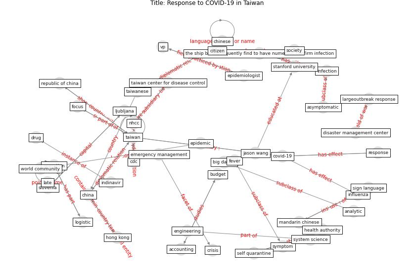

# Article: Response to COVID-19 in Taiwan (wang_response_2020)

* Source: [10.1001/jama.2020.3151](https://doi.org/10.1001/jama.2020.3151)
* Year: 2020
* Cluster: [city-health](cluster_14)

## Keywords

 * accounting, action item, allegheny general hospital, [analytic](keyword_analytic), andrew ku, asymptomatic, atononinvasive, autodock vina, [big datum](keyword_big_datum), budget, [cdc](keyword_cdc), [china](keyword_china), [chinese](keyword_chinese), citizen, [clinic](keyword_clinic), community member, concern, cookie policy, covid 19 in taiwan, [covid-19](keyword_covid-19), [crisis](keyword_crisis), critical care, disaster management center, disease stigma, drug, emergency management, [engineering](keyword_engineering), [epidemic](keyword_epidemic), epidemiologist, fever, focus, global health, [government](keyword_government), gynecology, health authority, [hong kong](keyword_hong_kong), [hospital](keyword_hospital), indinavir, [infection](keyword_infection), [influenza](keyword_influenza), international atomic energy agency, jason wang, largeoutbreak response, late, ljubljana, [logistic](keyword_logistic), macau, mandarin chinese, [mask](keyword_mask), ministry, monitor electronically, my fair lady, national health insurance administration, neonatologist, [new york city](keyword_new_york_city), news release, nhcc, nhi identification card, nucleotide analogue, on line order, [operation](keyword_operation), [outbreak](keyword_outbreak), pan t, panic, pharmacy, prevalence, [public health](keyword_public_health), real time analytic, republic of china, response, robert h, rosettacommon, self quarantine, sensitive, short message service, sign language, [slovenia](keyword_slovenia), sm, [society](keyword_society), stanford university, supplement, [symptom](keyword_symptom), system science, taipei medical university, [taiwan](keyword_taiwan), taiwan cdc, taiwan center for disease control, taiwanese, taxi, taxi stand, the ship be subsequently find to have numerous confirm infection, uncertainty, [vienna](keyword_vienna), vp, vò, wear mask, who response, world community, worldwide epidemic, [wuhan](keyword_wuhan)

## Concepts

 

## Neighbours

### Closest articles

* Coronavirus disease 2019: The harms of exaggerated information and non‐evidence‐based measures - [LINK](article_ioannidis_coronavirus_2020)
* Covid-19 and community mitigation strategies in a pandemic - [LINK](article_ebrahim_covid-19_2020)
*  - [LINK](article_mehtab_alam_role_2021)
* Contributions to the mitigation of the COVID-19 pandemic - [LINK](article_pilz_contributions_2022)
* Amplifying the role of knowledge translation platforms in the COVID-19 pandemic response - [LINK](article_el-jardali_amplifying_2020)
* From Viral City to Smart City: Learning from Pandemic Experiences - [LINK](article_sakellarides_viral_2020)
* Supporting Technologies for COVID-19 Prevention: Systemized Review - [LINK](article_zhao_supporting_2022)
* COVID-19 and social inequalities: a complex and dynamic interaction - [LINK](article_quantin_covid-19_2022)
* Rotating groups at work, school best against COVID-19 spread: Study - [LINK](article_afp_rotating_2021)

### Closest BPs

* Blueprint: Resilience in staffing and skills training - [LINK](bp_12)
* Blueprint: Smart Locker System - [LINK](bp_1)
* Blueprint: Rotational Shift System - [LINK](bp_0)
