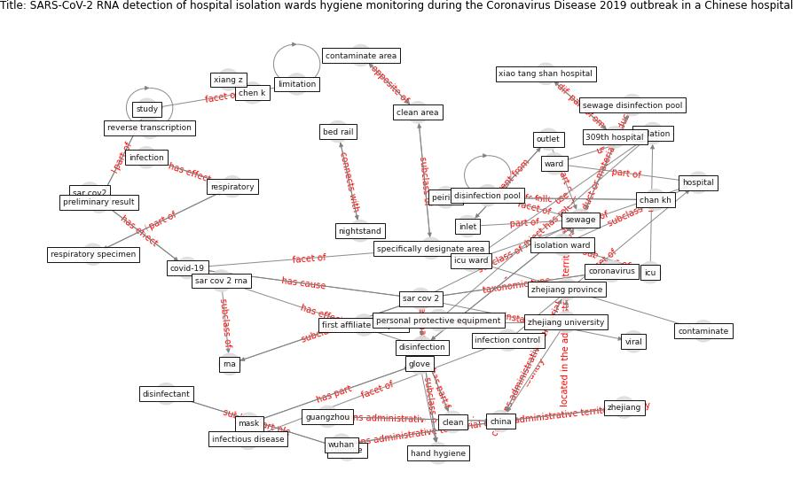

# Article: __SARS-CoV-2 RNA detection of hospital isolation wards hygiene monitoring during the Coronavirus Disease 2019 outbreak in a Chinese hospital__ (wang_sars-cov-2_2020)

* [10.1016/j.ijid.2020.04.024](https://doi.org/10.1016/j.ijid.2020.04.024)
* Cluster: [air-sars](cluster_2)

## Keywords

* [sar cov 2](keyword_sar_cov_2), [disinfection](keyword_disinfection), [china](keyword_china), [sewage](keyword_sewage), [hospital](keyword_hospital), [respiratory](keyword_respiratory), [coronavirus](keyword_coronavirus), [isolation ward](keyword_isolation_ward), [covid-19](keyword_covid-19), xu xw, [zhejiang university](keyword_zhejiang_university), [infection](keyword_infection), mer, mechanical ventilation, nightstand

## Keywords at large

* [biophilic design](keyword_biophilic_design), [architecture](keyword_architecture), [sustainable architecture](keyword_sustainable_architecture), [nature](keyword_nature), [design](keyword_design), [biophilic](keyword_biophilic), [environ](keyword_environ), [biophilia](keyword_biophilia), [wellbeing](keyword_wellbeing), [health](keyword_health)

## Concepts

 

### References 

* [Air, Surface Environmental, and Personal
Protective Equipment Contamination by Severe
Acute Respiratory Syndrome Coronavirus 2
(SARS-CoV-2) From a Symptomatic Patient](article_ong_air_2020)

### Cited by 

* [Readiness Assessment of Green Building
Certification Systems for Residential Buildings
during Pandemics](article_tleuken_readiness_2021)
* [Assessment method for new sustainability indicators
providing pandemic resilience for residential buildings](article_tokazhanov_assessment_2021)
* [How is COVID-19 Experience Transforming
Sustainability Requirements of Residential
Buildings? A Review](article_tokazhanov_how_2020)
* [A review of facilities management interventions to
mitigate respiratory infections in existing buildings](article_zhang_review_2022)
