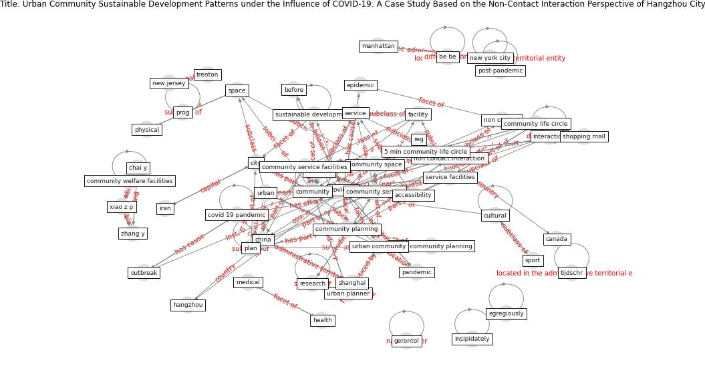

# Article: Urban Community Sustainable Development Patterns under the Influence of COVID-19: A Case Study Based on the Non-Contact Interaction Perspective of Hangzhou City (wang_urban_2021)

* Source: [10.3390/su13063575](https://doi.org/10.3390/su13063575)
* Year: 2021
* Cluster: [urban-city](cluster_13)

## Keywords

 * 10 min, 5 min, 5 min community life circle, accessibility, analysis, andreev p, assoc, be be, before, [beijing](keyword_beijing), [berlin](keyword_berlin), budapest, [canada](keyword_canada), chai y, [china](keyword_china), [city](keyword_city), [community](keyword_community), community life circle, community planning, community service, community service facilities, community space, community welfare facilities, [covid 19 pandemic](keyword_covid_19_pandemic), [covid-19](keyword_covid-19), cultural, datum collection, decentralization, [economy](keyword_economy), [education](keyword_education), egregiously, [epidemic](keyword_epidemic), facility, [germany](keyword_germany), gerontol, gulou district, hangzhou, [health](keyword_health), hungary, insipidately, [interaction](keyword_interaction), interactive activities, iran, j w, kraków, life circle, lifestyle, [manhattan](keyword_manhattan), [medical](keyword_medical), mokhtarian p, [need](keyword_need), [new jersey](keyword_new_jersey), [new york](keyword_new_york), [new york city](keyword_new_york_city), non contact, [non contact interaction](keyword_non_contact_interaction), on, online shopping, organization, [outbreak](keyword_outbreak), [pandemic](keyword_pandemic), [physical](keyword_physical), piously, [plan](keyword_plan), [poland](keyword_poland), policy pract, post pandemic period, post-pandemic, prog, [public transport](keyword_public_transport), reg, [research](keyword_research), resident, salomon i, service, service facilities, [shanghai](keyword_shanghai), shopping mall, [social](keyword_social), [society](keyword_society), song r, [space](keyword_space), spatial, sport, [study](keyword_study), supermarket, survey, [sustainable development](keyword_sustainable_development), teach, tehran, tijdschr, [toronto](keyword_toronto), [trenton](keyword_trenton), [urban](keyword_urban), urban community, urban community planning, urban planner, [usa](keyword_usa), xiao z p, zhang y

## Concepts

 

## Neighbours

### Closest articles

* Housing Experience in Gated Communities in the Time of Pandemics: Lessons Learned from COVID-19 - [LINK](article_asfour_housing_2022)
* Assessment of COVID-19 precautionary measures in sports facilities: A case study on a health club in Saudi Arabia - [LINK](article_ibrahim_assessment_2022)
* 10 Adaptive Measures for Public Places to face the COVID 19 Pandemic Outbreak - [LINK](article_cheshmehzangi_10_2020)
* Eviction, Health Inequity, and the Spread of COVID-19: Housing Policy as a Primary Pandemic Mitigation Strategy - [LINK](article_benfer_eviction_2021)
* A Mixed Approach on Resilience of Spanish Dwellings and Households during COVID-19 Lockdown - [LINK](article_cuerdo-vilches_mixed_2020)
* Questioning the use of the balcony in apartments during the COVID-19 pandemic process - [LINK](article_aydin_questioning_2020)
* Dangerous liaisons? Applying the social harm perspective to the social inequality, housing and health trifecta during the Covid-19 pandemic - [LINK](article_gurney_dangerous_2021)
* Public housing and COVID-19: contestation, challenge and change - [LINK](article_power_public_2020)
* Home garden use during COVID-19: Associations with physical and mental wellbeing in older adults - [LINK](article_corley_home_2021)
* The City Under COVID‐19: Podcasting As Digital Methodology - [LINK](article_rogers_city_2020)

### Closest BPs

* Blueprint: Resilience in staffing and skills training - [LINK](bp_12)
* Blueprint: Architecture design - [LINK](bp_2)
* Blueprint: Building Adaptation during a pandemic - [LINK](bp_14)
