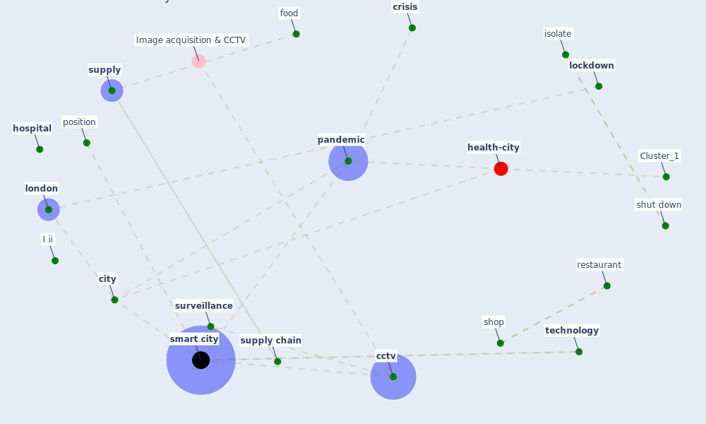

# Article: The Smart City and Covid‐19 (webb_smart_2020)

* Source: [10.1049/iet-smc.2020.0024](https://doi.org/10.1049/iet-smc.2020.0024)
* Year: 2020
* Cluster: [health-city](cluster_1)

## Keywords

 * I ii, [adapt](keyword_adapt), adapt and evolve, [alert](keyword_alert), authoritarianism, [cctv](keyword_cctv), [city](keyword_city), city be well be, civil liberty issue, congestion, connecticut, [covid-19](keyword_covid-19), [crisis](keyword_crisis), crisis management, datum security, delete, delete it, delete it as soon as possible, [delivery](keyword_delivery), difference across city, different requirement and solution, doctor, economically, emergency service, [epidemic](keyword_epidemic), evolve, expert, food, high temperature, home working technology, [hong kong](keyword_hong_kong), [hospital](keyword_hospital), [india](keyword_india), isolate, location datum, [lockdown](keyword_lockdown), lockdown be lift, [logistic](keyword_logistic), [london](keyword_london), madrid, [manhattan](keyword_manhattan), [mask](keyword_mask), metro, military, mobile phone, [monitor](keyword_monitor), mutation, name and shame, new delhi, new haven, [new york city](keyword_new_york_city), normality, office worker, [pandemic](keyword_pandemic), people monitor, phone, [population](keyword_population), position, position technology, prosecute, protective clothing, protest, [public transport](keyword_public_transport), railway, react to it, recover, [recovery](keyword_recovery), [research](keyword_research), restaurant, restriction on who enter and leave, road, [sanitation](keyword_sanitation), securely store, securely store such datum, self isolation, [shop](keyword_shop), shut down, [smart](keyword_smart), [smart city](keyword_smart_city), smart city technology, smart health, socially, [society](keyword_society), specialist health unit, street carnival, [supply](keyword_supply), [supply chain](keyword_supply_chain), surgeon, [surveillance](keyword_surveillance), [technology](keyword_technology), [temperature](keyword_temperature), [test](keyword_test), the possibility that it or some mutation, track, track individual, [transportation](keyword_transportation), unwell, vibrancy, [virus](keyword_virus), waterway

## Concepts

 

## Neighbours

### Closest articles

* The three modes of existence of the pandemic smart city - [LINK](article_soderstrom_three_2021)
* The Emergence of Anti-Privacy and Control at the Nexus between the Concepts of Safe City and Smart City - [LINK](article_allam_emergence_2019)
* Learning from the COVID-19 pandemic in governing smart cities - [LINK](article_bolivar_learning_2022)
* Contributions of Smart City Solutions and Technologies to Resilience against the COVID-19 Pandemic: A Literature Review - [LINK](article_sharifi_contributions_2021)
* Smart cities and the pandemic: digital technologies on the urban management of Brazilian cities - [LINK](article_fariniuk_smart_2020)
* Future (post-COVID) digital, smart and sustainable cities in the wake of 6G: Digital twins, immersive realities and new urban economies - [LINK](article_allam_future_2021)
* On the Coronavirus (COVID-19) Outbreak and the Smart City Network: Universal Data Sharing Standards Coupled with Artificial Intelligence (AI) to Benefit Urban Health Monitoring and Management - [LINK](article_allam_coronavirus_2020)
* Smart cities and a data-driven response to COVID-19 - [LINK](article_james_smart_2020)
* Pandemic stricken cities on lockdown. Where are our planning and design professionals [now, then and into the future]? - [LINK](article_allam_pandemic_2020)
* The COVID-19 pandemic: Impacts on cities and major lessons for urban planning, design, and management - [LINK](article_sharifi_covid-19_2020)

### Closest BPs

* Blueprint: Monitoring of wastewater - [LINK](bp_21)
* Blueprint: Resilience in staffing and skills training - [LINK](bp_12)
* Blueprint: Air Cleaning Plants - [LINK](bp_15)
