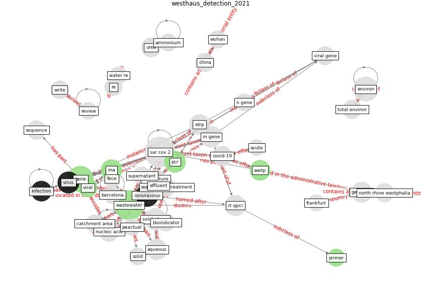

# Article: __Detection of SARS-CoV-2 in raw and treated wastewater in Germany – Suitability for COVID-19 surveillance and potential transmission risks__ (westhaus_detection_2021)

* [10.1016/j.scitotenv.2020.141750](https://doi.org/10.1016/j.scitotenv.2020.141750)
* Cluster: [wastewater-sars](cluster_4)

## Keywords

[wastewater](keyword_wastewater), [gene](keyword_gene), [coronavirus](keyword_coronavirus), [virus](keyword_virus), [pcr](keyword_pcr), [rna](keyword_rna), [wwtp](keyword_wwtp)

## Concepts

 

### References 

* [First confirmed detection of SARS-CoV-2 in untreated
wastewater in Australia: A proof of concept for the
wastewater surveillance of COVID-19 in the community](article_ahmed_first_2020)
* [First detection of SARS-CoV-2 in untreated wastewaters
in Italy](article_la_rosa_first_2020)
* [SARS-CoV-2 in wastewater: potential health risk, but
also data source](article_lodder_sars-cov-2_2020)
* [Presence of SARS-Coronavirus-2 RNA in Sewage and
Correlation with Reported COVID-19 Prevalence in
the Early Stage of the Epidemic in The
Netherlands](article_medema_presence_2020)
* [Aerosol and Surface Stability of SARS-CoV-2 as
Compared with SARS-CoV-1](article_van_doremalen_aerosol_2020)

### Cited by 

