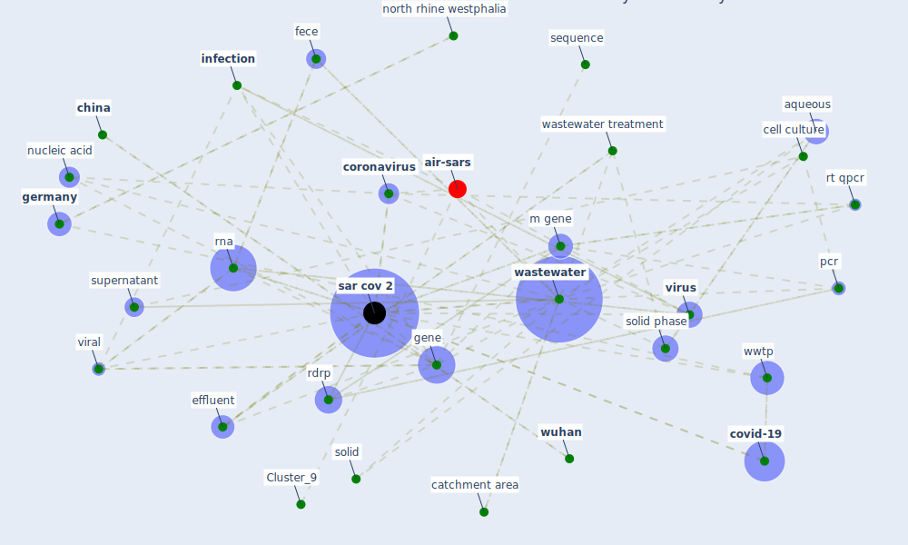

# Article: Detection of SARS-CoV-2 in raw and treated wastewater in Germany – Suitability for COVID-19 surveillance and potential transmission risks (westhaus_detection_2021)

* Source: [10.1016/j.scitotenv.2020.141750](https://doi.org/10.1016/j.scitotenv.2020.141750)
* Year: 2021
* Cluster: [wastewater-water](cluster_0)

## Keywords

 * 4 1 discussion, accumulate, acute, ammonium, aqueous, [australia](keyword_australia), [barcelona](keyword_barcelona), bio rad, bioindicator, c2, catchment area, cell, cell culture, [china](keyword_china), coefficient of determination, conceptualization, [control](keyword_control), cool down, [coronavirus](keyword_coronavirus), [covid-19](keyword_covid-19), creatinine, ct, cumulative, cytopathic effect, din, early warning, effluent, emscher, [epidemiology](keyword_epidemiology), excrete, fece, [france](keyword_france), frankfurt, [gene](keyword_gene), genre, [germany](keyword_germany), hygiene, [infection](keyword_infection), inflow, [influent](keyword_influent), [italy](keyword_italy), [japan](keyword_japan), liquid, louisiana, m gene, methanol, methodology, [microbiol](keyword_microbiol), mol, n gene, nitrogen, north rhine westphalia, nucleic acid, oldenburg, optimization, [outbreak](keyword_outbreak), [pandemic](keyword_pandemic), paris, [pcr](keyword_pcr), peactual, phylogenetic, positive control, [primer](keyword_primer), [public health](keyword_public_health), quantification, rdrp, [rna](keyword_rna), rt qpcr, rtqpcr, [sample](keyword_sample), sanger sequencing, [sanitation](keyword_sanitation), [sar cov 2](keyword_sar_cov_2), sar cov 2 pandemic, [sar cov2](keyword_sar_cov2), science fiction, sequence, [sewage](keyword_sewage), sludge, solid, [solid phase](keyword_solid_phase), [spain](keyword_spain), specific, standard protocol, supernatant, [symptom](keyword_symptom), urea, [usa](keyword_usa), [viral](keyword_viral), [virus](keyword_virus), [wastewater](keyword_wastewater), wastewater treatment, wastewater treatment plant, [water](keyword_water), water board, westhau, [wuhan](keyword_wuhan), [wwtp](keyword_wwtp), wwtp klem, yamanashi prefecture

## Concepts

 

## Neighbours

### Closest articles

* First confirmed detection of SARS-CoV-2 in untreated wastewater in Australia: A proof of concept for the wastewater surveillance of COVID-19 in the community - [LINK](article_ahmed_first_2020)
* SARS-CoV-2 RNA in wastewater anticipated COVID-19 occurrence in a low prevalence area - [LINK](article_randazzo_sars-cov-2_2020)
* First detection of SARS-CoV-2 in untreated wastewaters in Italy - [LINK](article_la_rosa_first_2020)
* SARS-CoV-2 Titers in Wastewater Are Higher than Expected from Clinically Confirmed Cases - [LINK](article_wu_sars-cov-2_2020)
* Wastewater-Based Epidemiology to monitor COVID-19 outbreak: Present and future diagnostic methods to be in your radar - [LINK](article_barcelo_wastewater-based_2020)
* Presence of SARS-Coronavirus-2 RNA in Sewage and Correlation with Reported COVID-19 Prevalence in the Early Stage of the Epidemic in The Netherlands - [LINK](article_medema_presence_2020)
* A Continuously Active Antimicrobial Coating effective against Human Coronavirus 229E - [LINK](article_ikner_continuously_2020)
* The removal of airborne SARS-CoV-2 and other microbial bioaerosols by air filtration on COVID-19 surge units - [LINK](article_conway-morris_removal_2021)

### Closest BPs

* Blueprint: Negative pressure rooms - [LINK](bp_13)
* Blueprint: Smart Locker System - [LINK](bp_1)
* Blueprint: Rotational Shift System - [LINK](bp_0)
