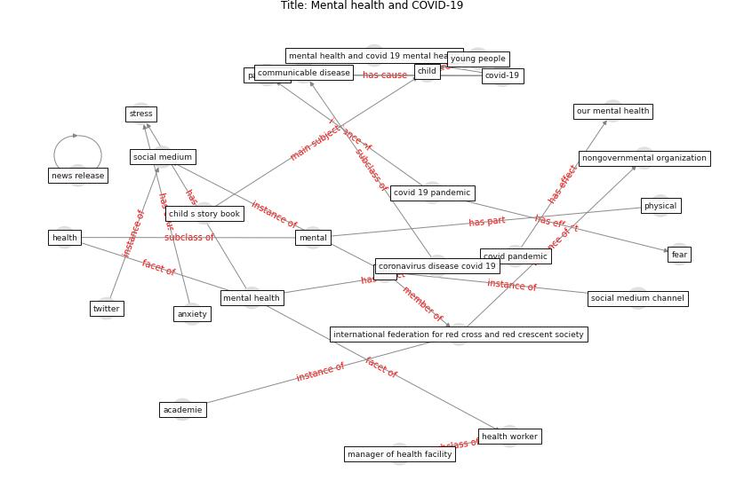

# Article: Mental health and COVID-19 (who_mental_2021)

* [https://www.who.int/teams/mental-health-and-substance-use/mental-health-and-covid-19](https://www.who.int/teams/mental-health-and-substance-use/mental-health-and-covid-19)
* Year: 2021
* Cluster: [mental-health](cluster_11)

## Keywords

 * academie, [anxiety](keyword_anxiety), child, child s story book, communicable disease, coronavirus disease covid 19, [covid 19 pandemic](keyword_covid_19_pandemic), covid pandemic, [covid-19](keyword_covid-19), [fear](keyword_fear), [health](keyword_health), health worker, international federation for red cross and red crescent society, manager of health facility, [mental](keyword_mental), [mental health](keyword_mental_health), mental health and covid 19 mental health, news release, nongovernmental organization, our mental health, [pandemic](keyword_pandemic), [physical](keyword_physical), [social medium](keyword_social_medium), social medium channel, [stress](keyword_stress), [twitter](keyword_twitter), who, young people

## Concepts

 

## Neighbours

### Closest articles

* Mental Health and the Covid-19 Pandemic - [LINK](article_pfefferbaum_mental_2020)
* Psychological Effects of Home Confinement and Social Distancing Derived from COVID-19 in the General Population—A Systematic Review - [LINK](article_rodriguez-fernandez_psychological_2021)
* Home garden use during COVID-19: Associations with physical and mental wellbeing in older adults - [LINK](article_corley_home_2021)
* Mental health economics: A prospective study on psychological flourishing and associations with healthcare costs and sickness benefit transfers in Denmark - [LINK](article_santini_mental_2021)
* COVID-19 Lockdown: Housing Built Environment’s Effects on Mental Health - [LINK](article_amerio_covid-19_2020)
* COVID-19 media fatigue: predictors of decreasing interest and avoidance of COVID-19–related news - [LINK](article_buneviciene_covid-19_2021)
* How loneliness is talked about in social media during COVID-19 pandemic: Text mining of 4,492 Twitter feeds - [LINK](article_koh_how_2022)
* The impacts of knowledge, risk perception, emotion and information on citizens’ protective behaviors during the outbreak of COVID-19: a cross-sectional study in China - [LINK](article_ning_impacts_2020)
* Assessment of COVID-19 precautionary measures in sports facilities: A case study on a health club in Saudi Arabia - [LINK](article_ibrahim_assessment_2022)
* Attitudes towards outdoor and neighbour noise during the COVID-19 lockdown: A case study in London - [LINK](article_lee_attitudes_2021)

### Closest BPs

* Blueprint: Air Cleaning Plants - [LINK](bp_15)
* Blueprint: Tender support at building stage - [LINK](bp_9)
* Blueprint: Building Adaptation during a pandemic - [LINK](bp_14)
