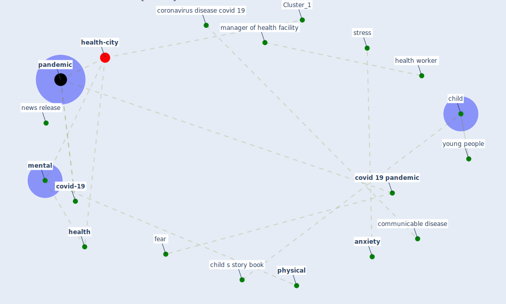

# Article: Mental health and COVID-19 (who_mental_2021)

* [https://www.who.int/teams/mental-health-and-substance-use/mental-health-and-covid-19](https://www.who.int/teams/mental-health-and-substance-use/mental-health-and-covid-19)
* Year: 2021
* Cluster: [health-city](cluster_1)

## Keywords

 * [anxiety](keyword_anxiety), [child](keyword_child), child s story book, communicable disease, coronavirus disease covid 19, [covid 19 pandemic](keyword_covid_19_pandemic), [covid-19](keyword_covid-19), fear, [health](keyword_health), health worker, manager of health facility, [mental](keyword_mental), news release, [pandemic](keyword_pandemic), [physical](keyword_physical), [stress](keyword_stress), young people

## Concepts

 

## Neighbours

### Closest articles

* Mental Health and the Covid-19 Pandemic - [LINK](article_pfefferbaum_mental_2020)
* Psychological Effects of Home Confinement and Social Distancing Derived from COVID-19 in the General Population—A Systematic Review - [LINK](article_rodriguez-fernandez_psychological_2021)
* Home garden use during COVID-19: Associations with physical and mental wellbeing in older adults - [LINK](article_corley_home_2021)
* The psychological impact of COVID-19 on the mental health in the general population - [LINK](article_serafini_psychological_2020)
* COVID-19 Lockdown: Housing Built Environment’s Effects on Mental Health - [LINK](article_amerio_covid-19_2020)
* Mental health economics: A prospective study on psychological flourishing and associations with healthcare costs and sickness benefit transfers in Denmark - [LINK](article_santini_mental_2021)
* COVID-19 media fatigue: predictors of decreasing interest and avoidance of COVID-19–related news - [LINK](article_buneviciene_covid-19_2021)
* The impacts of knowledge, risk perception, emotion and information on citizens’ protective behaviors during the outbreak of COVID-19: a cross-sectional study in China - [LINK](article_ning_impacts_2020)
* What drives unverified information sharing and cyberchondria during the COVID-19 pandemic? - [LINK](article_laato_what_2020)
* The changes in the effects of social media use of Cypriots due to COVID-19 pandemic - [LINK](article_kaya_changes_2020)

### Closest BPs

* Blueprint: Resilience in staffing and skills training - [LINK](bp_12)
* Blueprint: Installing high-efficiency air filters - [LINK](bp_11)
* Blueprint: Air Cleaning Plants - [LINK](bp_15)
