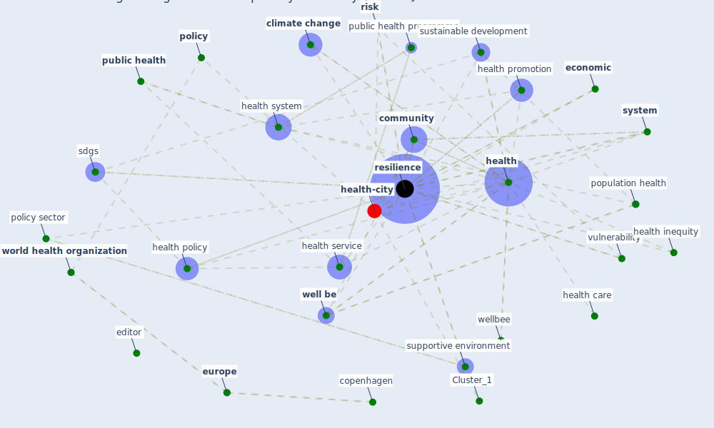

# Article: Strengthening resilience: a priority shared by Health 2020 and (who_strengthening_2017)

* [https://www.euro.who.int/__data/assets/pdf_file/0005/351284/resilience-report-20171004-h1635.pdf](https://www.euro.who.int/__data/assets/pdf_file/0005/351284/resilience-report-20171004-h1635.pdf)
* Year: 2017
* Cluster: [health-city](cluster_1)

## Keywords

 * absorptive, action, [adapt](keyword_adapt), adaptive, adulthood, adversity, alma ata, amartya sen, asset, buzz word, [child](keyword_child), [climate change](keyword_climate_change), [community](keyword_community), condition, constitution, cope, copenhagen, deficit model, determinant of their health, development, [disease](keyword_disease), ecology, [economic](keyword_economic), [ecosystem](keyword_ecosystem), editor, [education](keyword_education), [environment](keyword_environment), [europe](keyword_europe), [evidence](keyword_evidence), [factor](keyword_factor), family, hazard, [health](keyword_health), [health care](keyword_health_care), health equity, health field, health inequity, health policy, health promotion, health sector, health service, [health system](keyword_health_system), individual, initiative, [innovation](keyword_innovation), intervention, jheoe, kauai, [london](keyword_london), make it happen, malta, masten, masten as, millennium development goal, non health sector, ottawa, paris, [patient](keyword_patient), person centre care, pichon f, [policy](keyword_policy), policy sector, population health, poverty, [public health](keyword_public_health), public health programme, [resilience](keyword_resilience), [risk](keyword_risk), rockefeller foundation, salutogenesis, [sdgs](keyword_sdgs), [sector](keyword_sector), [shock](keyword_shock), smith, [social](keyword_social), [spain](keyword_spain), stewardship function, stewart m, supportive environment, [sustainable development](keyword_sustainable_development), [sustainable development goal](keyword_sustainable_development_goal), [system](keyword_system), system level, system level resilience, system resilience, theory, transformative, [united nations](keyword_united_nations), valetta, valletta, [vulnerability](keyword_vulnerability), webpage, [well be](keyword_well_be), [wellbee](keyword_wellbee), who int, who small country, who small country initiative, [world health organization](keyword_world_health_organization), yes they do, ziglio e

## Concepts

 

## Neighbours

### Closest articles

* Guidelines for resilience systems analysis - [LINK](article_oecd_guidelines_2014)
* COVID-19 as a Harbinger of Transforming Infrastructure Resilience - [LINK](article_carvalhaes_covid-19_2020)
* A review of definitions and measures of system resilience - [LINK](article_hosseini_review_2016)
* Preparing critical infrastructure for the future: Lessons learnt from the Covid-19 pandemic - [LINK](article_tomalska_preparing_2022)
* COVID-19 and a new resilient infrastructure landscape - [LINK](article_oecd_covid-19_2021)
* Assessment method for new sustainability indicators providing pandemic resilience for residential buildings - [LINK](article_tokazhanov_assessment_2021)
* China adapts survey drones to enforce world’s largest quarantine - [LINK](article_liu_china_2020)
* Readiness Assessment of Green Building Certification Systems for Residential Buildings during Pandemics - [LINK](article_tleuken_readiness_2021)
* How to Make Green Building Certification &amp; Rating Systems More Pandemic-Sustainable? - [LINK](article_ujikawa_how_2022)

### Closest BPs

* Blueprint: Monitoring of wastewater - [LINK](bp_21)
* Blueprint: Indoor Environmental Quality (IEQ) monitoring system - [LINK](bp_3)
* Blueprint: Air Cleaning Plants - [LINK](bp_15)
