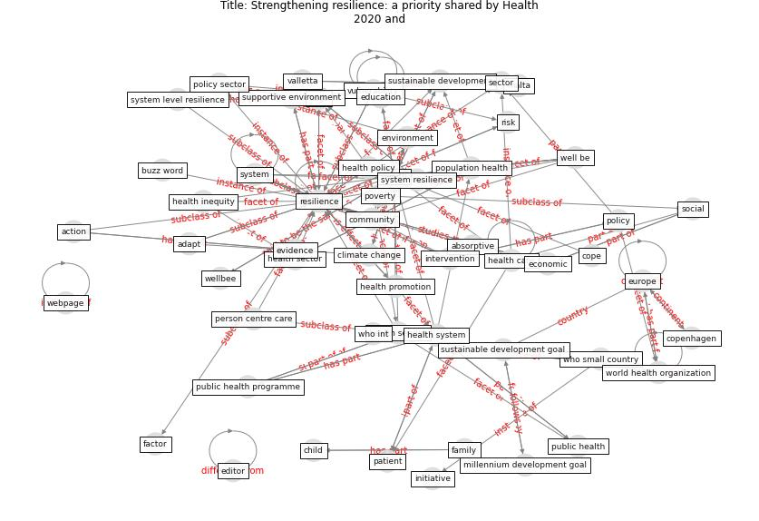

# Article: __Strengthening resilience: a priority shared by Health 2020 and__ (who_strengthening_2017)

* URL: [https://www.euro.who.int/__data/assets/pdf_file/0005/351284/resilience-report-20171004-h1635.pdf](https://www.euro.who.int/__data/assets/pdf_file/0005/351284/resilience-report-20171004-h1635.pdf)
* Year: 2017

## Keywords

[resilience](keyword_resilience), [health](keyword_health), [system](keyword_system), [risk](keyword_risk)

## Concepts

 

