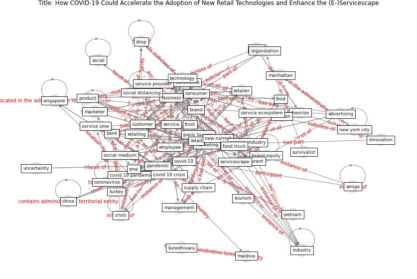

# Article: __How COVID-19 Could Accelerate the Adoption of New Retail Technologies and Enhance the (E-)Servicescape__ (willems_how_2021)

* [10.1007/978-981-33-4134-0_6](https://doi.org/10.1007/978-981-33-4134-0_6)
* Cluster: [resilience-health](cluster_4)

## Keywords

* [pandemic](keyword_pandemic), [covid-19](keyword_covid-19), [marketing](keyword_marketing), [customer](keyword_customer), [consumer](keyword_consumer), [business](keyword_business), [online](keyword_online), [retail](keyword_retail), [service](keyword_service), [food truck](keyword_food_truck), [retailer](keyword_retailer), brand, [covid 19 pandemic](keyword_covid_19_pandemic), [singapore](keyword_singapore), [employee](keyword_employee)

## Keywords at large

* [biophilic design](keyword_biophilic_design), [architecture](keyword_architecture), [sustainable architecture](keyword_sustainable_architecture), [nature](keyword_nature), [design](keyword_design), [biophilic](keyword_biophilic), [environ](keyword_environ), [biophilia](keyword_biophilia), [wellbeing](keyword_wellbeing), [health](keyword_health)

## Abstract

The current COVID-19 pandemic and containment regulations
bring unseen challenges to service organizations. The
physical and social servicescape are heavily impacted by
government regulations on social distancing and people’s
fear of contamination. Retailing has traditionally
predominantly been a ‘game of people’, yet faced with
the consequences of this pandemic, our innate preference
for a ‘human touch’ seems to decline. This not only
boosts e-commerce but also paves the way for the
accelerated adoption of technological advancements in
brick-and-mortar retailing, as their perceived usefulness
has increased. Retailing is steadily being infused with
digital technology and these technologies could prove
especially valuable in the post-pandemic ‘new normal’,
preventing the erosion of the customer- and employee
experience. Particular problems to be solved are, among
others, managing waiting lines, disinfection, diminished
interpersonal contact between customers and frontline
employees, in-store crowding, less testing and touching of
products, payment, and delivery. This chapter discusses
what challenges COVID-19 poses to conventional
(e-)servicescapes, and how technologies, ranging from
augmented- and virtual reality, over robots and wireless
payment, to sensory-enabling technologies for webshops, can
offer solutions. Successful business applications are
presented, while also considering hurdles. This chapter
demonstrates how the current pandemic crisis could catalyze
the digital augmentation of retailing and services.

## Concepts

 

