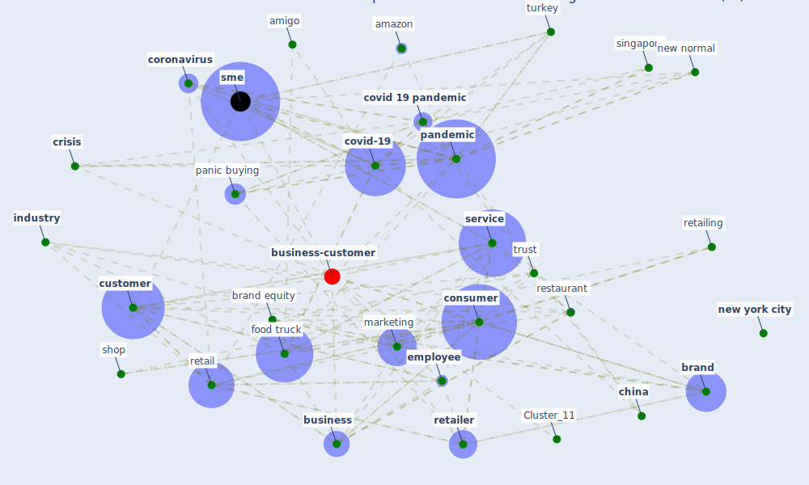

# Article: How COVID-19 Could Accelerate the Adoption of New Retail Technologies and Enhance the (E-)Servicescape (willems_how_2021)

* Source: [10.1007/978-981-33-4134-0_6](https://doi.org/10.1007/978-981-33-4134-0_6)
* Year: 2021
* Cluster: [construction-pandemic](cluster_1)

## Keywords

 * advertising, amazon, amigo, [bank](keyword_bank), brand, brand equity, brand image, [business](keyword_business), business model, [china](keyword_china), coffee, communication, [community](keyword_community), [consumer](keyword_consumer), [coronavirus](keyword_coronavirus), [covid 19 crisis](keyword_covid_19_crisis), [covid 19 pandemic](keyword_covid_19_pandemic), [covid-19](keyword_covid-19), [crisis](keyword_crisis), culture, [customer](keyword_customer), customer experience, customer satisfaction, e commerce, [economic](keyword_economic), [employee](keyword_employee), experience, face mask, family, food, food service, food truck, hospitality, hygiene, [industry](keyword_industry), [innovation](keyword_innovation), kraków, kuredhivaru, ljubljana, [lockdown](keyword_lockdown), [london](keyword_london), maldive, [management](keyword_management), [manager](keyword_manager), [manhattan](keyword_manhattan), marketer, [marketing](keyword_marketing), meta capability, new normal, [new york](keyword_new_york), [new york city](keyword_new_york_city), nomad lodge, nutritionist, organization, [pandemic](keyword_pandemic), panic buying, [poland](keyword_poland), product, psychology, rejectionist, [research](keyword_research), restaurant, retail, retailer, retailing, [russia](keyword_russia), [safety](keyword_safety), [service](keyword_service), service ecosystem, service encounter, service industry, service organization, service provider, service provision, service sme, servicescape, [shop](keyword_shop), singapore, [slovenia](keyword_slovenia), [sme](keyword_sme), [social](keyword_social), strait, strait time, sunday, supermarket, [supply chain](keyword_supply_chain), survivalist, sustainable, [technology](keyword_technology), theorize, tinker, [tourism](keyword_tourism), [training](keyword_training), trust, turkey, uber, uncertainty, [unesco](keyword_unesco), vietnam, [world heritage site](keyword_world_heritage_site)

## Concepts

 

## Neighbours

### Closest articles

* Retail Signage During the COVID-19 Pandemic - [LINK](article_mcneish_retail_2020)
* Touchless Retail: What the Rest of the World could learn from China’s new ways to shop - [LINK](article_capgemini_touchless_2020)
* Startups in times of crisis – A rapid response to the COVID-19 pandemic - [LINK](article_kuckertz_startups_2020)
* <scp>COVID</scp>             ‐19: Small and medium enterprises challenges and responses with creativity, innovation, and entrepreneurship - [LINK](article_thukral_covid19_2021)
* How COVID-19 Redefines the Concept of Sustainability - [LINK](article_hakovirta_how_2020)
* Strengthening resilience: a priority shared by Health 2020 and - [LINK](article_who_strengthening_2017)
* COVID-19 and regional solutions for mitigating the risk of SME finance in selected ASEAN member states - [LINK](article_taghizadeh-hesary_covid-19_2022)
* World Bank Development Report - [LINK](article_world_bank_world_2022)
*  - [LINK](article_yakubu_aminu_dodo_green_2020)

### Closest BPs

* Blueprint: Smart Locker System - [LINK](bp_1)
* Blueprint: Mental health – Belong: Do something with someone - [LINK](bp_19)
* Blueprint: Mental health – Act: Do something - [LINK](bp_18)
