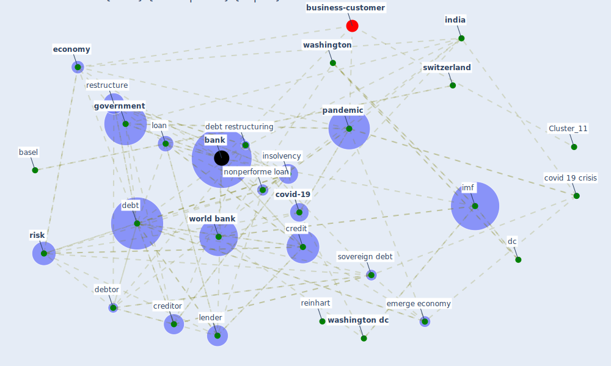

# Article: World Bank Development Report (world_bank_world_2022)

* [https://www.worldbank.org/en/publication/wdr2022](https://www.worldbank.org/en/publication/wdr2022)
* Year: 2022
* Cluster: [construction-pandemic](cluster_1)

## Keywords

 * advanced economy, [africa](keyword_africa), asset quality, [bank](keyword_bank), bank of america, bankruptcy, basel, benin, bond, borrower, [business](keyword_business), capital, carman m, cgap, chile, [china](keyword_china), collateral, colombia, [country](keyword_country), [covid 19 crisis](keyword_covid_19_crisis), [covid 19 pandemic](keyword_covid_19_pandemic), [covid-19](keyword_covid-19), credit, credit bureau, credit risk, creditor, [crisis](keyword_crisis), [datum](keyword_datum), dc, debt, debt crisis, debt distress, debt management, debt relief, debt restructuring, debt sustainability, debtor, default, [economic](keyword_economic), economic recovery, [economy](keyword_economy), emerge economy, emerge market, enterprise, [europe](keyword_europe), [european union](keyword_european_union), finance, financial, fintech, [government](keyword_government), green bond, [household](keyword_household), imf, income, [india](keyword_india), [indonesia](keyword_indonesia), inequality, insolvency, kenneth s rogoff, [kenya](keyword_kenya), lend, lender, liquidation, loan, [london](keyword_london), [low](keyword_low), low income country, micro, microfinance, middle income country, moratoria, mozambique, msme, [nairobi](keyword_nairobi), [nigeria](keyword_nigeria), nonperforme loan, npl, npls, [oecd](keyword_oecd), [pandemic](keyword_pandemic), paris, [policy](keyword_policy), poverty, [recovery](keyword_recovery), regulatory, reinhart, restructure, [risk](keyword_risk), rogoff, [sector](keyword_sector), small business, sovereign, sovereign debt, supervisory, [switzerland](keyword_switzerland), underwrite, [washington](keyword_washington), [washington dc](keyword_washington_dc), world, [world bank](keyword_world_bank)

## Concepts

 

## Neighbours

### Closest articles

* COVID-19 and regional solutions for mitigating the risk of SME finance in selected ASEAN member states - [LINK](article_taghizadeh-hesary_covid-19_2022)
* Covid-19 and asset management in EU: a preliminary assessment of performance and investment styles - [LINK](article_rizvi_covid-19_2020)
* Building sustainable finance for resilient protected and conserved areas: lessons from COVID-19 - [LINK](article_cumming_building_2021)
* Global value chains: Efficiency and risks in the context of COVID-19 - [LINK](article_oecd_global_2021)
* <scp>COVID</scp>             ‐19: Small and medium enterprises challenges and responses with creativity, innovation, and entrepreneurship - [LINK](article_thukral_covid19_2021)
* Startups in times of crisis – A rapid response to the COVID-19 pandemic - [LINK](article_kuckertz_startups_2020)
* The socio-economic implications of the coronavirus pandemic (COVID-19): A review - [LINK](article_nicola_socio-economic_2020)
* Mapping research in logistics and supply chain management during COVID-19 pandemic - [LINK](article_montoya-torres_mapping_2021)
* Urban design attributes and resilience: COVID-19 evidence from New York City - [LINK](article_yang_urban_2021)

### Closest BPs

* Blueprint: Smart Locker System - [LINK](bp_1)
* Blueprint: Resilience in staffing and skills training - [LINK](bp_12)
* Blueprint: Monitoring of wastewater - [LINK](bp_21)
