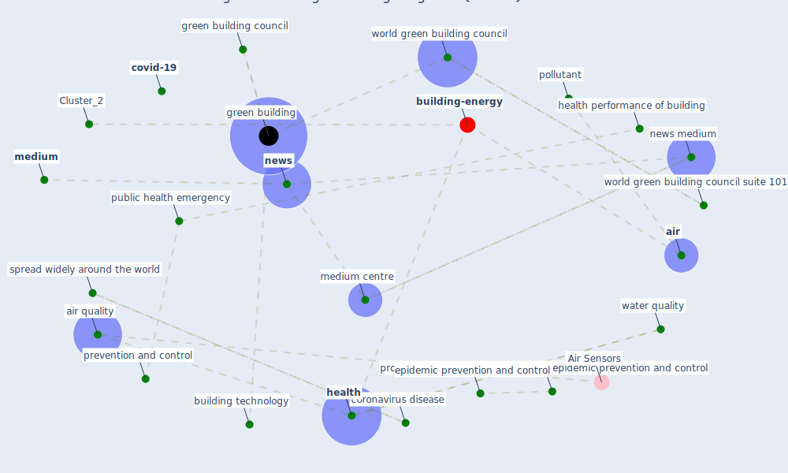

# Article: The contribution of green buildings in the fight against COVID-19 (world_green_building_council_contribution_2020)

* [https://www.worldgbc.org/news-media/contribution-green-buildings-fight-against-covid-19](https://www.worldgbc.org/news-media/contribution-green-buildings-fight-against-covid-19)
* Year: 2020
* Cluster: [building-energy](cluster_2)

## Keywords

 * accessibility, [air](keyword_air), air quality, ammonia, [antiviral](keyword_antiviral), asgb, asgb certification, benzene, [build](keyword_build), build base prevention and control, [building](keyword_building), building base, building technology, building technology in china, [china](keyword_china), contain the epidemic, contribution green building fight against covid 19, contributiongreen building fight against covid 19, [control](keyword_control), cookie policy, coronavirus disease, coronavirus disease covid 19, covid 19 prevention and control, [covid-19](keyword_covid-19), cross infection, [disease](keyword_disease), [drug](keyword_drug), [epidemic](keyword_epidemic), epidemic prevention and control, [facebook](keyword_facebook), fitzrovia, [formaldehyde](keyword_formaldehyde), gather, gather base, [green building](keyword_green_building), green building council, green building in the fight against covid 19, green development, [health](keyword_health), health performance of building, immunity, [infection](keyword_infection), [lockdown](keyword_lockdown), [london](keyword_london), major public health emergency, [medium](keyword_medium), medium centre, new technology, newman st, [news](keyword_news), news medium, particulate matter, [pollutant](keyword_pollutant), [prevention](keyword_prevention), prevention and control, [privacy policy](keyword_privacy_policy), property management, provide convenience and facility for epidemic prevention and control, [public health](keyword_public_health), public health emergency, radon, restrict to community, self limit disease, sharer, spread widely around the world, [technology](keyword_technology), term condition, the contribution of green building in the fight against covid 19, [unesco](keyword_unesco), [united nations](keyword_united_nations), [virus](keyword_virus), [washington dc](keyword_washington_dc), waste management, water quality, water quality monitoring, world government center, [world green building council](keyword_world_green_building_council), world green building council day, world green building council suite 101, world headquarter, [world heritage site](keyword_world_heritage_site), worldgbc, worldgbc org, worldwide around the world

## Concepts

 

## Neighbours

### Closest articles

* How will COVID-19 change future building regulations? - [LINK](article_hmc_architects_how_2020)
* Will a pandemic change building codes? - [LINK](article_rozgus_will_2020)
* Architectural Design Drives the Biogeography of Indoor Bacterial Communities - [LINK](article_kembel_architectural_2014)
* The COVID-19 Impact on Flexible Office Space - [LINK](article_clifton_covid-19_2020)
* Public housing and COVID-19: contestation, challenge and change - [LINK](article_power_public_2020)
* It’s time to reimagine where and how work will get done (PwC’s US Remote Work Survey) - [LINK](article_pricewaterhousecoopers_its_2021)
* Biophilic design in architecture and its contributions to health, well-being, and sustainability: A critical review - [LINK](article_zhong_biophilic_2022)
* Dangerous liaisons? Applying the social harm perspective to the social inequality, housing and health trifecta during the Covid-19 pandemic - [LINK](article_gurney_dangerous_2021)
* How Architecture Fails in Conditions of Crisis: a Discussion on the Value of Interior Design over the COVID-19 Outbreak - [LINK](article_rassia_how_2020)
* A study on office workplace modification during the COVID-19 pandemic in The Netherlands - [LINK](article_hou_study_2021)

### Closest BPs

* Blueprint: Tracking and enforcing use of Personal Protective Equipment - [LINK](bp_23)
* Blueprint: Building Adaptation during a pandemic - [LINK](bp_14)
* Blueprint: Architecture design - [LINK](bp_2)
