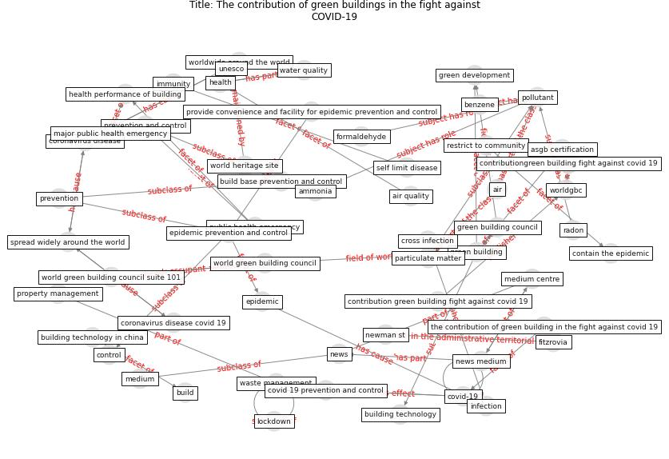

# Article: The contribution of green buildings in the fight againstCOVID-19 (world_green_building_council_contribution_2020)

* [https://www.worldgbc.org/news-media/contribution-green-buildings-fight-against-covid-19](https://www.worldgbc.org/news-media/contribution-green-buildings-fight-against-covid-19)
* Year: 2020
* Cluster: [building-space](cluster_1)

## Keywords

 * accessibility, [air](keyword_air), air quality, ammonia, [antiviral](keyword_antiviral), antiviral drug, asgb, asgb certification, benzene, [build](keyword_build), build base prevention and control, [building](keyword_building), building base, building technology, building technology in china, [china](keyword_china), contain the epidemic, contribution green building fight against covid 19, contributiongreen building fight against covid 19, [control](keyword_control), cookie policy, [coronavirus](keyword_coronavirus), coronavirus disease, coronavirus disease covid 19, covid 19 prevention and control, [covid-19](keyword_covid-19), cross infection, [disease](keyword_disease), drug, [epidemic](keyword_epidemic), [epidemic prevention and control](keyword_epidemic_prevention_and_control), [facebook](keyword_facebook), facility, fitzrovia, [formaldehyde](keyword_formaldehyde), [gather](keyword_gather), gather base, [green building](keyword_green_building), green building council, green building in the fight against covid 19, green development, [health](keyword_health), health performance of building, immunity, [infection](keyword_infection), isolation and observation room, [lockdown](keyword_lockdown), [london](keyword_london), major public health emergency, medical room, medium, medium centre, natural ventilation, new technology, newman st, [news](keyword_news), news medium, particulate matter, [pollutant](keyword_pollutant), prevention, prevention and control, [privacy policy](keyword_privacy_policy), property management, protect the health, provide convenience and facility for epidemic prevention and control, [public health](keyword_public_health), public health emergency, radon, restrict to community, self limit disease, sharer, spread widely around the world, storage room, [technology](keyword_technology), term condition, the contribution of green building in the fight against covid 19, transitional residential room, [unesco](keyword_unesco), [united nations](keyword_united_nations), [virus](keyword_virus), [washington dc](keyword_washington_dc), waste management, water quality, water quality monitoring, world government center, world green building council, world green building council day, world green building council suite 101, world headquarter, [world heritage site](keyword_world_heritage_site), worldgbc, worldgbc org, worldwide around the world

## Concepts

 

## Neighbours

### Closest articles

*  - [LINK](article_yakubu_aminu_dodo_green_2020)
* COVID-19 Experience Transforming the Protective Environment of Office Buildings and Spaces - [LINK](article_phapant_covid-19_2021)
* Health, Wellbeing \& Productivity in Offices - [LINK](article_world_green_building_council_health_2014)
* Occupant health in buildings: Impact of the COVID-19 pandemic on the opinions of building professionals and implications on research - [LINK](article_awada_occupant_2022)
* Ten questions concerning occupant health in buildings during normal operations and extreme events including the COVID-19 pandemic - [LINK](article_awada_ten_2021)
* A comprehensive review on indoor air quality monitoring systems for enhanced public health - [LINK](article_saini_comprehensive_2020)
* A study on office workplace modification during the COVID-19 pandemic in The Netherlands - [LINK](article_hou_study_2021)
* Smart buildings: how a virus might lead to healthier buildings - Arup - [LINK](article_lam_smart_2021)
* It’s time to reimagine where and how work will get done (PwC’s US Remote Work Survey) - [LINK](article_pricewaterhousecoopers_its_2021)
* Scalable IoT Architecture for Monitoring IEQ Conditions in Public and Private Buildings - [LINK](article_calvo_scalable_2022)

### Closest BPs

* Blueprint: Indoor Environmental Quality (IEQ) monitoring system - [LINK](bp_3)
* Blueprint: Building Adaptation during a pandemic - [LINK](bp_14)
* Blueprint: Architecture design - [LINK](bp_2)
