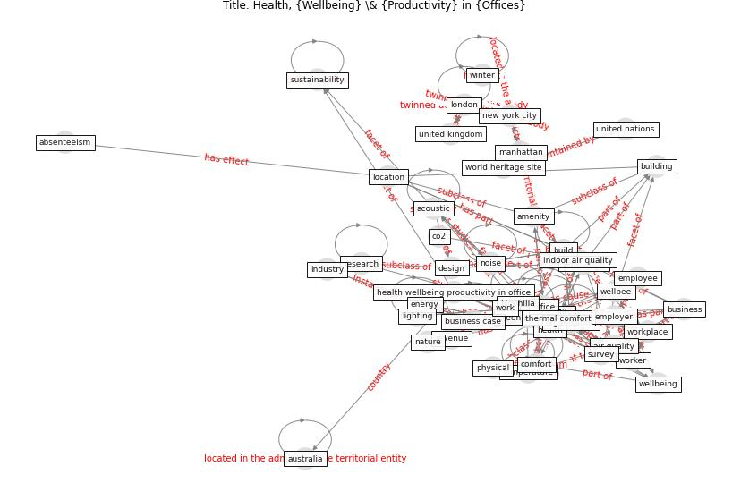

# Article: Health, Wellbeing \& Productivity in Offices (world_green_building_council_health_2014)

* [https://ukgbc.s3.eu-west-2.amazonaws.com/wp-content/uploads/2017/09/05152806/Health20Wellbeing20and20Productivity20in20Offices20-20The20next20chapter20for20green20building20Full20Report_0.pdf](https://ukgbc.s3.eu-west-2.amazonaws.com/wp-content/uploads/2017/09/05152806/Health20Wellbeing20and20Productivity20in20Offices20-20The20next20chapter20for20green20building20Full20Report_0.pdf)
* Year: 2014
* Cluster: [building-space](cluster_1)

## Keywords

 * absence, absenteeism, acoustic, air quality, [amenity](keyword_amenity), [australia](keyword_australia), behaviour, benefit, [biodiversity](keyword_biodiversity), biophilia, [build](keyword_build), [building](keyword_building), [business](keyword_business), business case, co2, collaboration, colour, [comfort](keyword_comfort), communication, [construction](keyword_construction), cool, cost, creativity, cultural, [datum](keyword_datum), daylight, daylighte, decision make, [design](keyword_design), distraction, dj, [employee](keyword_employee), [employer](keyword_employer), [energy](keyword_energy), energy use, [environment](keyword_environment), exercise, expense, finance, [green building](keyword_green_building), [health](keyword_health), health wellbeing productivity in office, [impact](keyword_impact), indoor air, [indoor air quality](keyword_indoor_air_quality), [industry](keyword_industry), [information](keyword_information), investor, las vegas, light, lighting, [location](keyword_location), [london](keyword_london), london borough of camden, look and feel, [manhattan](keyword_manhattan), medellin, [medical](keyword_medical), [nature](keyword_nature), [new york city](keyword_new_york_city), [noise](keyword_noise), occupier, [office](keyword_office), office worker, [organisation](keyword_organisation), [people](keyword_people), perception, performance, [pollutant](keyword_pollutant), [productivity](keyword_productivity), [public transport](keyword_public_transport), [research](keyword_research), retention, revenue, [russia](keyword_russia), [sound](keyword_sound), sp, [space](keyword_space), st petersburg, summer, survey, [sustainability](keyword_sustainability), [temperature](keyword_temperature), [unesco](keyword_unesco), [united kingdom](keyword_united_kingdom), [united nations](keyword_united_nations), university of oxford, [ventilation](keyword_ventilation), view, walk, wearable technology, [well be](keyword_well_be), [wellbee](keyword_wellbee), [window](keyword_window), [winter](keyword_winter), [work](keyword_work), [worker](keyword_worker), [workplace](keyword_workplace), [workstation](keyword_workstation), [world heritage site](keyword_world_heritage_site)

## Concepts

 

## Neighbours

### Closest articles

* Occupant health in buildings: Impact of the COVID-19 pandemic on the opinions of building professionals and implications on research - [LINK](article_awada_occupant_2022)
* Ten questions concerning occupant health in buildings during normal operations and extreme events including the COVID-19 pandemic - [LINK](article_awada_ten_2021)
* The effect of a redesigned floor plan, occupant density and the quality of indoor climate on the cost of space, productivity and sick leave in an office building–A case study - [LINK](article_saari_effect_2006)
* Smart buildings: how a virus might lead to healthier buildings - Arup - [LINK](article_lam_smart_2021)
* Architectural Design Drives the Biogeography of Indoor Bacterial Communities - [LINK](article_kembel_architectural_2014)
* COVID-19 Experience Transforming the Protective Environment of Office Buildings and Spaces - [LINK](article_phapant_covid-19_2021)
*  - [LINK](article_yakubu_aminu_dodo_green_2020)
* Designing Post COVID-19 Buildings: Approaches for Achieving Healthy Buildings - [LINK](article_navaratnam_designing_2022)
* A study on office workplace modification during the COVID-19 pandemic in The Netherlands - [LINK](article_hou_study_2021)
* Reflecting on Impacts of COVID19 on Sustainable Buildings and Cities - [LINK](article_gonzalez_reflecting_2021)

### Closest BPs

* Blueprint: Indoor Environmental Quality (IEQ) monitoring system - [LINK](bp_3)
* Blueprint: Mental health – Belong: Do something with someone - [LINK](bp_19)
* Blueprint: Mental health – Act: Do something - [LINK](bp_18)
