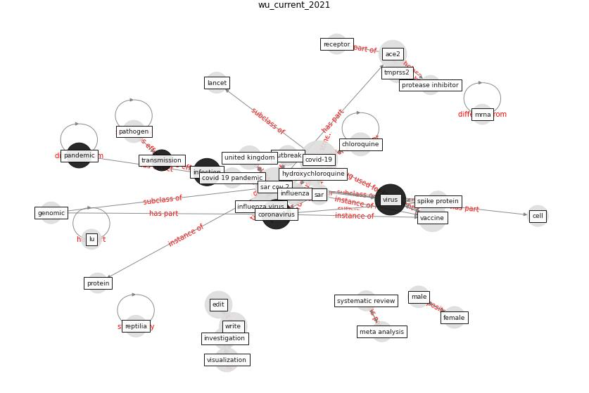

# Article: __Current knowledge of COVID-19: Advances, challenges and future perspectives__ (wu_current_2021)

* [10.1016/j.bsheal.2021.06.001](https://doi.org/10.1016/j.bsheal.2021.06.001)
* Cluster: [air-sars](cluster_2)

## Keywords

* [sar cov 2](keyword_sar_cov_2), [covid-19](keyword_covid-19), [virus](keyword_virus), [coronavirus](keyword_coronavirus), [vaccine](keyword_vaccine), [write](keyword_write), [ace2](keyword_ace2), [infection](keyword_infection), [edit](keyword_edit), [visualization](keyword_visualization), [pandemic](keyword_pandemic), [united kingdom](keyword_united_kingdom), hydroxychloroquine, chloroquine, [influenza virus](keyword_influenza_virus)

## Keywords at large

* [biophilic design](keyword_biophilic_design), [architecture](keyword_architecture), [sustainable architecture](keyword_sustainable_architecture), [nature](keyword_nature), [design](keyword_design), [biophilic](keyword_biophilic), [environ](keyword_environ), [biophilia](keyword_biophilia), [wellbeing](keyword_wellbeing), [health](keyword_health)

## Concepts

 

