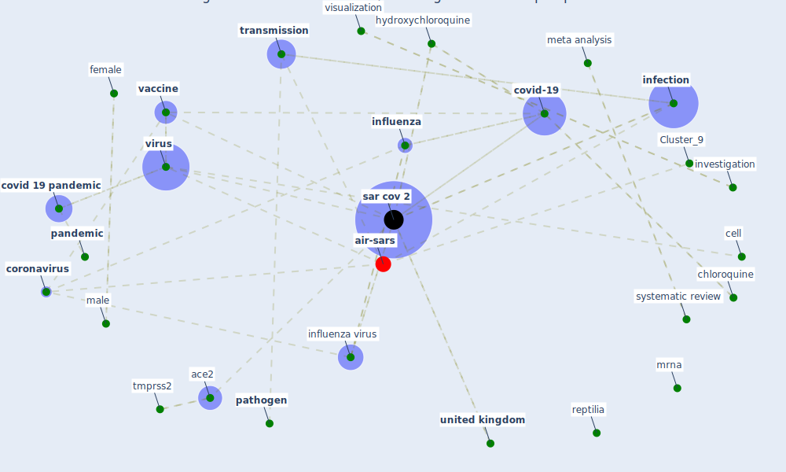

# Article: Current knowledge of COVID-19: Advances, challenges and future perspectives (wu_current_2021)

* Source: [10.1016/j.bsheal.2021.06.001](https://doi.org/10.1016/j.bsheal.2021.06.001)
* Year: 2021
* Cluster: [air-sars](cluster_9)

## Keywords

 * SARS-CoV-2, [a c](keyword_a_c), ace2, antibodie, attenuate vaccine, avian, bahel, baricitinib, blood group a, blood group o, c w, cell, [china](keyword_china), chloroquine, [coronavirus](keyword_coronavirus), coronavirus disease 19, covid 19 infection, covid 19 outbreak, [covid 19 pandemic](keyword_covid_19_pandemic), covid 19 study, [covid-19](keyword_covid-19), death, [disease](keyword_disease), [drug](keyword_drug), e582, face mask, female, first response, [gene](keyword_gene), [genome](keyword_genome), [germany](keyword_germany), hydroxychloroquine, [india](keyword_india), [infection](keyword_infection), [influenza](keyword_influenza), [influenza virus](keyword_influenza_virus), interferon, investigation, j h, j m, j r, klok, l graham, l y wang, l y y, [london](keyword_london), lu, lueder, lung, lung cell, m hang, m q, m s, male, mao, [meta analysis](keyword_meta_analysis), molecular, mother, mrna, neuropilin 1, nucleotide, [outbreak](keyword_outbreak), [pandemic](keyword_pandemic), [pathogen](keyword_pathogen), peng, phenotype, postpandemic period, protease inhibitor, protein, receptor, reptilia, [research](keyword_research), respiratory failure, rheumatoid arthritis, sar cov, [sar cov 2](keyword_sar_cov_2), severe acute respiratory syndrome coronavirus 2, siner, siu, spike protein, summer, systematic review, thrombotic, thrombotic complication, tmprss2, [transmission](keyword_transmission), [united kingdom](keyword_united_kingdom), [usa](keyword_usa), v menachery, v2, [vaccine](keyword_vaccine), van paassen, [virus](keyword_virus), virus infection, visualization, w h, [winter](keyword_winter), worldometer, yin, youth innovation promotion association

## Concepts

 

## Neighbours

### Closest articles

* COVID-19 Pandemic: Prevention and Protection Measures to Be Adopted at the Workplace - [LINK](article_cirrincione_covid-19_2020)
* COVID-19 and its Modes of Transmission - [LINK](article_karia_covid-19_2020)
* Sustainability of Coronavirus on Different Surfaces - [LINK](article_suman_sustainability_2020)
* COVID-19: Risk assessment and mitigation measures in healthcare and non-healthcare workplaces - [LINK](article_fawzy_covid-19_2021)
* Aerosol and Surface Stability of SARS-CoV-2 as Compared with SARS-CoV-1 - [LINK](article_van_doremalen_aerosol_2020)
* Persistence of coronaviruses on inanimate surfaces and their inactivation with biocidal agents - [LINK](article_kampf_persistence_2020)
* Physical interventions to interrupt or reduce the spread of respiratory viruses: systematic review - [LINK](article_jefferson_physical_2008)
* COVID-19 Prevention and Control Measures in Workplace Settings: A Rapid Review and Meta-Analysis - [LINK](article_ingram_covid-19_2021)
* The effect of a redesigned floor plan, occupant density and the quality of indoor climate on the cost of space, productivity and sick leave in an office building–A case study - [LINK](article_saari_effect_2006)
* A Surface Coating that Rapidly Inactivates SARS-CoV-2 - [LINK](article_behzadinasab_surface_2020)

### Closest BPs

* Blueprint: Negative pressure rooms - [LINK](bp_13)
* Blueprint: Installing high-efficiency air filters - [LINK](bp_11)
* Blueprint: Installing UV in ductwork - [LINK](bp_10)
