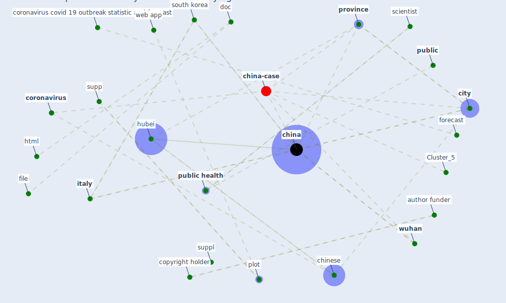

# Article: Open-source analytics tools for studying the COVID-19 coronavirus outbreak (wu_open-source_2020)

* Source: [10.1101/2020.02.25.20027433](https://doi.org/10.1101/2020.02.25.20027433)
* Year: 2020
* Cluster: [health-city](cluster_1)

## Keywords

 * aggregate datum, api, application programming interface, [author funder](keyword_author_funder), bcloud, [berlin](keyword_berlin), brooking, cent tencent com, change data format, [china](keyword_china), [chinese](keyword_chinese), chinese city, chinese government, chinese province, [city](keyword_city), city in hubei, city in other region, code, confirm case, [conflict of interest](keyword_conflict_of_interest), consistent, [copyright holder](keyword_copyright_holder), [coronavirus](keyword_coronavirus), coronavirus covid 19 outbreak, coronavirus covid 19 outbreak statistic and forecast, coronavirus infection, country with rapidly grow covid 19 case, [covid-19](keyword_covid-19), covid19 outbreak, dashboard, [dataset](keyword_dataset), datum source, datum visualization, death, death rate, disease transmission, doc, epidemiologist, [europe](keyword_europe), extreme measure, file, forecast, [france](keyword_france), functionality, github, github repository, guangzhou, [html](keyword_html), [hubei](keyword_hubei), interactive app, interactive web app, iran, [italy](keyword_italy), kraków, locally, manage, mexico, monitor the datum source, news aggregator, none, novel coronavirus, official, overwhelmed healthcare system, plot, [poland](keyword_poland), [province](keyword_province), [public](keyword_public), [public health](keyword_public_health), r package, repository, [research](keyword_research), [researcher](keyword_researcher), rstudio, rstudio shiny, scientist, shiny framework, situation in china, software, south dakota state university, [south korea](keyword_south_korea), [spain](keyword_spain), [spread](keyword_spread), springer berlin, springer series, statistic, [study](keyword_study), study and manage, supp, suppl, tencent, tencent capital, toutiao, toutiao api, tutorial, [united states](keyword_united_states), web app, web base, [world health organization](keyword_world_health_organization), [wuhan](keyword_wuhan), zhejiang

## Concepts

 

## Neighbours

### Closest articles

* The effect of human mobility and control measures on the COVID-19 epidemic in China - [LINK](article_kraemer_effect_2020)
* An investigation of transmission control measures during the first 50 days of the COVID-19 epidemic in China - [LINK](article_tian_investigation_2020)
*  - [LINK](article_mehtab_alam_role_2021)
* Study of COVID-19 pandemic in London (UK) from urban context - [LINK](article_ghosh_study_2020)
* Combating COVID-19—The role of robotics in managing public health and infectious diseases - [LINK](article_yang_combating_2020)
* Response to COVID-19 in Taiwan - [LINK](article_wang_response_2020)
* Telehealth overpromises during the Covid-19 pandemic - [LINK](article_ostherr_telehealth_2020)
* Mobile Technology Solution for COVID-19: Surveillance and Prevention - [LINK](article_raza_mobile_2021)
* Danish disinfection robots save lives in the fight against the Corona virus \textbar Shaping Europe’s digital future - [LINK](article_ec_views_danish_2020)
* Coronavirus: Can artificial intelligence be smart enough to detect fake news? - [LINK](article_tong_coronavirus_2020)

### Closest BPs

* Blueprint: Resilience in staffing and skills training - [LINK](bp_12)
* Blueprint: Installing UV in ductwork - [LINK](bp_10)
* Blueprint: Negative pressure rooms - [LINK](bp_13)
