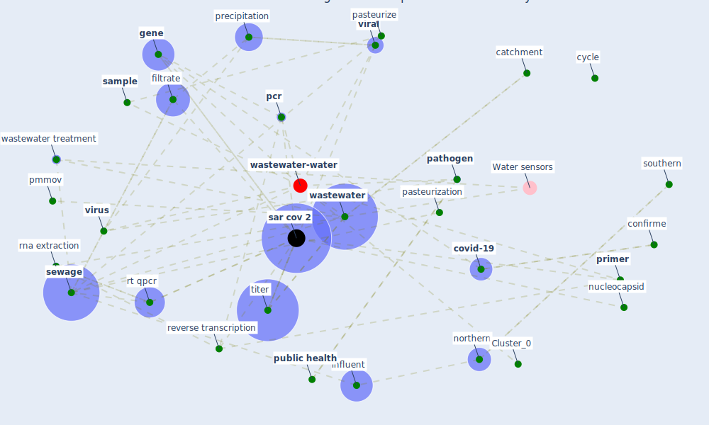

# Article: SARS-CoV-2 Titers in Wastewater Are Higher than Expected from Clinically Confirmed Cases (wu_sars-cov-2_2020)

* Source: [10.1128/mSystems.00614-20](https://doi.org/10.1128/mSystems.00614-20)
* Year: 2020
* Cluster: [wastewater-water](cluster_0)

## Keywords

 * [analysis](keyword_analysis), asymptomatic, biobanke, biosafety cabinet, catchment, catchment area, cdna, centrifugation, chemical, [china](keyword_china), clinically, conclusion, confirme, [coronavirus](keyword_coronavirus), [covid-19](keyword_covid-19), cycle, [deviation](keyword_deviation), disease prevalence, e3, effective heat inactivation, endo n, extraction, gel electrophoresis, [gene](keyword_gene), [genome](keyword_genome), gerba cp, ghaeli n, gu x, hamza, health care facility, [hong kong](keyword_hong_kong), iker bc, inactivate, inactivation, [infection](keyword_infection), [influent](keyword_influent), lake ontario, liu s, lyse, massachusett, massachusetts consortium on pathogen readiness, [material](keyword_material), milliliter, morgenstern b, municipal, municipality, murine hepatitis virus, nacl, nasopharyngeal, normalization, normalize, northern, nucleic acid, nucleocapsid, nucleocapsid gene, pasteurization, pasteurize, [pathogen](keyword_pathogen), [pcr](keyword_pcr), pepper mild mottle virus, pmmov, polyethylene glycol 8000, precipitation, [primer](keyword_primer), [public health](keyword_public_health), public health emergency, [qpcr](keyword_qpcr), reverse primer, reverse transcription, rna extraction, rna virus, rt qpcr, [sample](keyword_sample), [sar cov 2](keyword_sar_cov_2), sar cov 2 rna, [sar cov2](keyword_sar_cov2), sequence, [sewage](keyword_sewage), southern, stability, [surveillance](keyword_surveillance), [symptom](keyword_symptom), taqman, [temperature](keyword_temperature), thermofisher, titer, torrey jr, trizol, university of notre dame, [uv](keyword_uv), [viral](keyword_viral), [virus](keyword_virus), [wastewater](keyword_wastewater), wastewater treatment, wastewater treatment facility, wastewater treatment plant, wild poliovirus, [winter](keyword_winter), filter, filtrate

## Concepts

 

## Neighbours

### Closest articles

* Detection of SARS-CoV-2 in raw and treated wastewater in Germany – Suitability for COVID-19 surveillance and potential transmission risks - [LINK](article_westhaus_detection_2021)
* Presence of SARS-Coronavirus-2 RNA in Sewage and Correlation with Reported COVID-19 Prevalence in the Early Stage of the Epidemic in The Netherlands - [LINK](article_medema_presence_2020)
* First confirmed detection of SARS-CoV-2 in untreated wastewater in Australia: A proof of concept for the wastewater surveillance of COVID-19 in the community - [LINK](article_ahmed_first_2020)
* First detection of SARS-CoV-2 in untreated wastewaters in Italy - [LINK](article_la_rosa_first_2020)
* SARS-CoV-2 RNA in wastewater anticipated COVID-19 occurrence in a low prevalence area - [LINK](article_randazzo_sars-cov-2_2020)
* Wastewater-Based Epidemiology to monitor COVID-19 outbreak: Present and future diagnostic methods to be in your radar - [LINK](article_barcelo_wastewater-based_2020)
* The removal of airborne SARS-CoV-2 and other microbial bioaerosols by air filtration on COVID-19 surge units - [LINK](article_conway-morris_removal_2021)
* A Continuously Active Antimicrobial Coating effective against Human Coronavirus 229E - [LINK](article_ikner_continuously_2020)

### Closest BPs

* Blueprint: Negative pressure rooms - [LINK](bp_13)
* Blueprint: Smart Locker System - [LINK](bp_1)
* Blueprint: Rotational Shift System - [LINK](bp_0)
