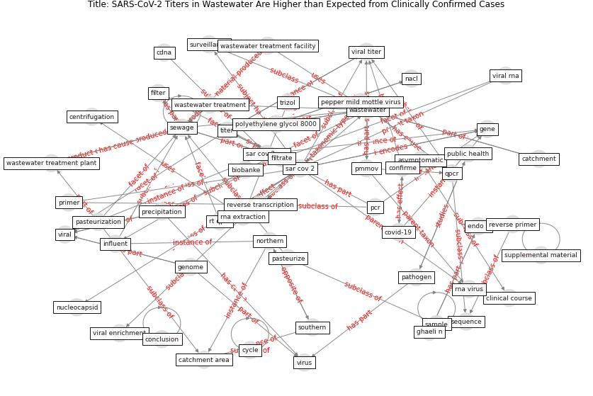

# Article: __SARS-CoV-2 Titers in Wastewater Are Higher than Expected from Clinically Confirmed Cases__ (wu_sars-cov-2_2020)

* [10.1128/mSystems.00614-20](https://doi.org/10.1128/mSystems.00614-20)
* Cluster: [wastewater-sars](cluster_12.md)

## Keywords

[wastewater](keyword_wastewater.md), [sewage](keyword_sewage.md), [viral](keyword_viral.md), [gene](keyword_gene.md), [titer](keyword_titer.md), [sample](keyword_sample.md), [primer](keyword_primer.md)

## Abstract

Wastewater-based surveillance is a promising approach for
proactive outbreak monitoring. SARS-CoV-2 is shed in stool
early in the clinical course and infects a large
asymptomatic population, making it an ideal target for
wastewater-based monitoring. In this study, we develop a
laboratory protocol to quantify viral titers in raw sewage
via qPCR analysis and validate results with sequencing
analysis. Our results suggest that the number of positive
cases estimated from wastewater viral titers is orders of
magnitude greater than the number of confirmed clinical
cases and therefore may significantly impact efforts to
understand the case fatality rate and progression of
disease. These data may help inform decisions surrounding
the advancement or scale-back of social distancing and
quarantine efforts based on dynamic wastewater
catchment-level estimations of prevalence. , ABSTRACT

Wastewater surveillance represents a complementary approach
to clinical surveillance to measure the presence and
prevalence of emerging infectious diseases like the novel
coronavirus SARS-CoV-2. This innovative data source can
improve the precision of epidemiological modeling to
understand the penetrance of SARS-CoV-2 in specific
vulnerable communities. Here, we tested wastewater
collected at a major urban treatment facility in
Massachusetts and detected SARS-CoV-2 RNA from the N gene
at significant titers (57 to 303 copies per ml of sewage)
in the period from 18 to 25 March 2020 using RT-qPCR. We
validated detection of SARS-CoV-2 by Sanger sequencing the
PCR product from the S gene. Viral titers observed were
significantly higher than expected based on clinically
confirmed cases in Massachusetts as of 25 March. Our
approach is scalable and may be useful in modeling the
SARS-CoV-2 pandemic and future outbreaks.

IMPORTANCE Wastewater-based surveillance is a promising
approach for proactive outbreak monitoring. SARS-CoV-2 is
shed in stool early in the clinical course and infects a
large asymptomatic population, making it an ideal target
for wastewater-based monitoring. In this study, we develop
a laboratory protocol to quantify viral titers in raw
sewage via qPCR analysis and validate results with
sequencing analysis. Our results suggest that the number of
positive cases estimated from wastewater viral titers is
orders of magnitude greater than the number of confirmed
clinical cases and therefore may significantly impact
efforts to understand the case fatality rate and
progression of disease. These data may help inform
decisions surrounding the advancement or scale-back of
social distancing and quarantine efforts based on dynamic
wastewater catchment-level estimations of prevalence.

## Concepts

 

