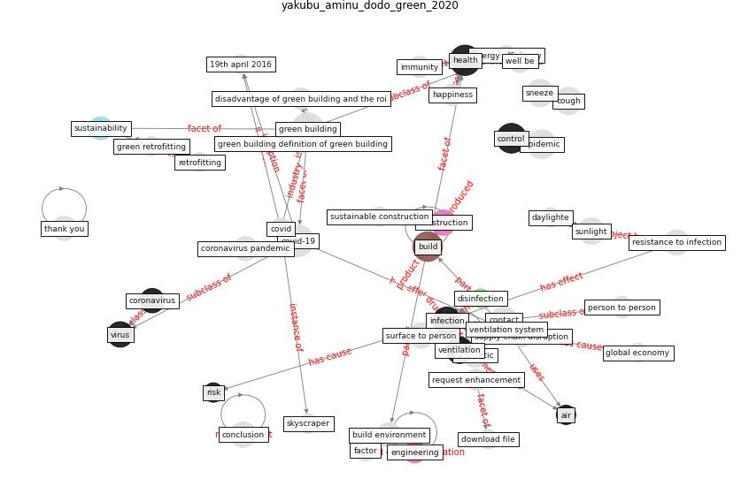

# Article: ____ (yakubu_aminu_dodo_green_2020)

* [10.13140/RG.2.2.36479.43686](https://doi.org/10.13140/RG.2.2.36479.43686)
* Cluster: [health-building](cluster_9)

## Keywords

* [green building](keyword_green_building), [covid-19](keyword_covid-19), [health](keyword_health), [control](keyword_control), [build](keyword_build), [epidemic](keyword_epidemic), [infection](keyword_infection), [cough](keyword_cough), [sneeze](keyword_sneeze), contact, [sunlight](keyword_sunlight), resistance to infection, surface to person, [virus](keyword_virus), [construction](keyword_construction)

## Keywords at large

* [covid-19](keyword_covid-19), [green building](keyword_green_building), [build](keyword_build), [health](keyword_health), [control](keyword_control), [epidemic](keyword_epidemic), [cough](keyword_cough), [sneeze](keyword_sneeze), [infection](keyword_infection), [ventilation](keyword_ventilation)

## Concepts

 

### Closest articles 

* [The contribution of green buildings in the fight against
COVID-19](article_world_green_building_council_contribution_2020)
* [Occupant health in buildings: Impact of the COVID-19 pandemic on the opinions of building professionals and implications on research](article_awada_occupant_2022)
* [Ten questions concerning occupant health in buildings during normal operations and extreme events including the COVID-19 pandemic](article_awada_ten_2021)
* [Health, Wellbeing \& Productivity in Offices](article_world_green_building_council_health_2014)
* [Smart buildings: how a virus might lead to healthier
buildings - Arup](article_lam_smart_2021)
* [Continuous IEQ monitoring system: Context and development](article_parkinson_continuous_2019)
* [COVID-19 Experience Transforming the Protective Environment of Office Buildings and Spaces](article_phapant_covid-19_2021)
* [An Intelligent IEQ Monitoring and Feedback System: Development and Applications](article_geng_intelligent_2021)
* [Scalable IoT Architecture for Monitoring IEQ Conditions in Public and Private Buildings](article_calvo_scalable_2022)
* [A study on office workplace modification during the COVID-19 pandemic in The Netherlands](article_hou_study_2021)

