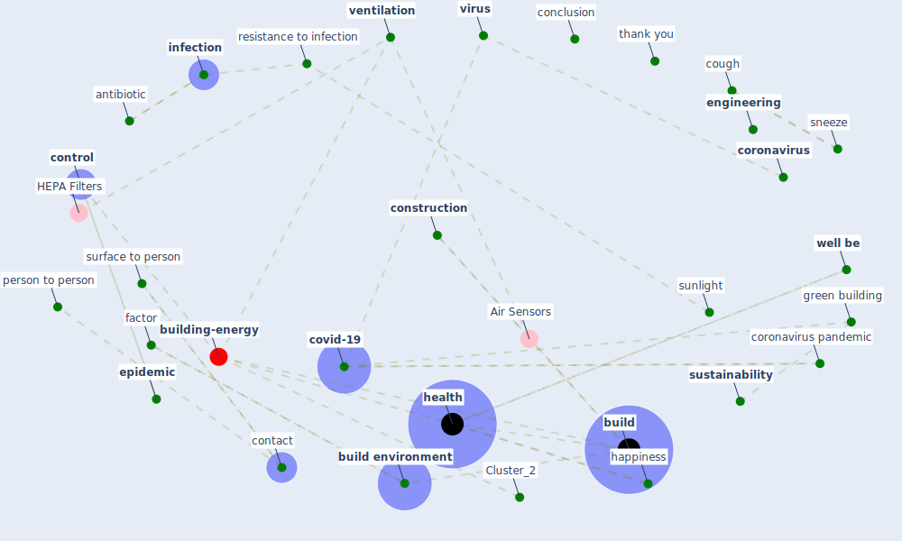

# Article:  (yakubu_aminu_dodo_green_2020)

* Source: [10.13140/RG.2.2.36479.43686](https://doi.org/10.13140/RG.2.2.36479.43686)
* Year: 2020
* Cluster: [building-energy](cluster_2)

## Keywords

 * [air](keyword_air), air quality, anonymous, antibacterial, [antibiotic](keyword_antibiotic), [architecture](keyword_architecture), [bacteria](keyword_bacteria), [build](keyword_build), [build environment](keyword_build_environment), build wellness, [building](keyword_building), building environment, [climate change](keyword_climate_change), conclusion, [construction](keyword_construction), [construction industry](keyword_construction_industry), contact, [control](keyword_control), [coronavirus](keyword_coronavirus), coronavirus pandemic, cough, covid era, [covid-19](keyword_covid-19), daylighte, direct contact, disadvantage of green building, disadvantage of green building and the roi, [disease](keyword_disease), [disinfection](keyword_disinfection), [download](keyword_download), download file, [energy efficiency](keyword_energy_efficiency), [engineering](keyword_engineering), [environment](keyword_environment), [epidemic](keyword_epidemic), epidemic prevention and control, factor, [green building](keyword_green_building), green building council, green building definition of green building, green retrofitting, happiness, [health](keyword_health), health and wellness, healthy world, history of the past pandemic, immunity, [india](keyword_india), [indoor](keyword_indoor), indoor air pollutant, [infection](keyword_infection), influence, lighting, lucknow, mouth, neoclassical, nose, nutrition, past pandemic, [pathogen](keyword_pathogen), person to person, pneumonia, [pollutant](keyword_pollutant), post covid, [prevention](keyword_prevention), public service facility, publication, publication stat, publication statistic, request enhancement, researchgate, resistance to infection, retrofitting, retrofitting building, [risk](keyword_risk), risk of infection, skyscraper, sneeze, sunlight, supply chain disruption, surface to person, [sustainability](keyword_sustainability), sustainable, sustainable construction, sustainable green building, sustainable site management, thank you, urban area, [ventilation](keyword_ventilation), ventilation system, [viral](keyword_viral), [virus](keyword_virus), [well be](keyword_well_be)

## Concepts

 

## Neighbours

### Closest articles

* Revisiting the built environment: 10 potential development changes and paradigm shifts due to COVID-19 - [LINK](article_cheshmehzangi_revisiting_2021)
* Navigating Climate Change: Rethinking the Role of Buildings - [LINK](article_cole_navigating_2020)
* Building up an ecologically sustainable and socially desirable post-COVID-19 future - [LINK](article_duflot_building_2021)
* A critical analysis of the impacts of COVID-19 on the global economy and ecosystems and opportunities for circular economy strategies - [LINK](article_ibn-mohammed_critical_2021)
* COVID-19 risks and systemic gaps in Nigeria: resilience building lessons for pandemic and climate change management - [LINK](article_lawal_covid-19_2022)
* COVID-19: IMPACT OF THE PANDEMIC ON THE SUSTAINABLE DEVELOPMENT GOALS - [LINK](article_samout_covid-19_2020)
* How COVID-19 Redefines the Concept of Sustainability - [LINK](article_hakovirta_how_2020)
* COVID-19 and the UN Sustainable Development Goals: Threat to Solidarity or an Opportunity? - [LINK](article_leal_filho_covid-19_2020)
* Urban planning after COVID-19 - [LINK](article_rtpi_urban_2021)
* What our response to the COVID-19 pandemic tells us of our capacity to respond to climate change - [LINK](article_gemenne_what_2020)

### Closest BPs

* Blueprint: Smart Locker System - [LINK](bp_1)
* Blueprint: Mental health – Belong: Do something with someone - [LINK](bp_19)
* Blueprint: Mental health – Act: Do something - [LINK](bp_18)
