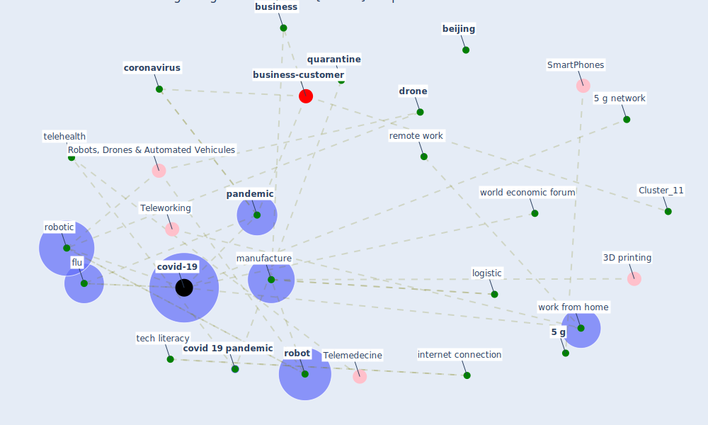

# Article: 10 tech trends getting us through the COVID-19 pandemic (yan_10_2020)

* [https://www.weforum.org/agenda/2020/04/10-technology-trends-coronavirus-covid19-pandemic-robotics-telehealth/](https://www.weforum.org/agenda/2020/04/10-technology-trends-coronavirus-covid19-pandemic-robotics-telehealth/)
* Year: 2020
* Cluster: [construction-pandemic](cluster_1)

## Keywords

 * 3d, [3d print](keyword_3d_print), 3d print product, 3dto print, [5 g](keyword_5_g), [5 g network](keyword_5_g_network), accept cookie, [ad](keyword_ad), [beijing](keyword_beijing), [business](keyword_business), [child](keyword_child), [china](keyword_china), class, cloud rave, college, college educate, [coronavirus](keyword_coronavirus), cost of compatible device, [covid 19 pandemic](keyword_covid_19_pandemic), covid 19 variant, [covid-19](keyword_covid-19), covid19 pandemic, deliver item, [delivery](keyword_delivery), delivery company, diagnosis, digitize world, disparity, [distance](keyword_distance), [drone](keyword_drone), e commerce, economic forum, [employee](keyword_employee), [employer](keyword_employer), english, español, [europe](keyword_europe), film, film production company, flu, have you read, high school, high school diploma, [home](keyword_home), in person interaction, inclusive access, income tax issue, [industry](keyword_industry), [internet](keyword_internet), internet connection, [italy](keyword_italy), labour law, labour law issue, lack of work life balance, lo scalzo, [lockdown](keyword_lockdown), [logistic](keyword_logistic), [loneliness](keyword_loneliness), [manufacture](keyword_manufacture), online entertainment, online gaming, online shopping, [outbreak](keyword_outbreak), [pandemic](keyword_pandemic), parent, personalise content, place of origin, [privacy](keyword_privacy), [privacy policy](keyword_privacy_policy), production, quarantine, read, regulation, [remote work](keyword_remote_work), remote work accept cookie, [robot](keyword_robot), robot delivery, [robotic](keyword_robotic), safe work environment, [society](keyword_society), [south korea](keyword_south_korea), stay home, [supply chain](keyword_supply_chain), supply chain 4 0, supply chain system, [symptom](keyword_symptom), tech literacy, [technology](keyword_technology), technology trend, [telehealth](keyword_telehealth), th ti h th t h l g, the spread, threat, trade, virus proof, vulnerable, [work](keyword_work), work from home, workforce, world economic forum

## Concepts

 

## Neighbours

### Closest articles

* Rotating groups at work, school best against COVID-19 spread: Study - [LINK](article_afp_rotating_2021)
* Reframe how to serve your community in the midst of a pandemic - [LINK](article_sutton_reframe_2020)
* What has been the impact of the COVID-19 pandemic on immigrants? An update on recent evidence - [LINK](article_oecd_what_2022)
* Mapping research in logistics and supply chain management during COVID-19 pandemic - [LINK](article_montoya-torres_mapping_2021)
* Global value chains: Efficiency and risks in the context of COVID-19 - [LINK](article_oecd_global_2021)
* The City Under COVID‐19: Podcasting As Digital Methodology - [LINK](article_rogers_city_2020)
* COVID-19 and the rise of intimate partner violence - [LINK](article_aguero_covid-19_2021)
* Multilevel Analysis of Personal, Non-Medical COVID-19-Related Impact Worldwide - [LINK](article_dye_multilevel_2020)
* Sustainable work throughout the life course: National policies and strategies, Publications Office of the European Union - [LINK](article_eurofund_sustainable_2016)
* How Covid-19 Has Permanently Changed the Fitness Industry - [LINK](article_davalos_how_2021)

### Closest BPs

* Blueprint: Smart Locker System - [LINK](bp_1)
* Blueprint: Resilience in staffing and skills training - [LINK](bp_12)
* Blueprint: Tracking and enforcing use of Personal Protective Equipment - [LINK](bp_23)
