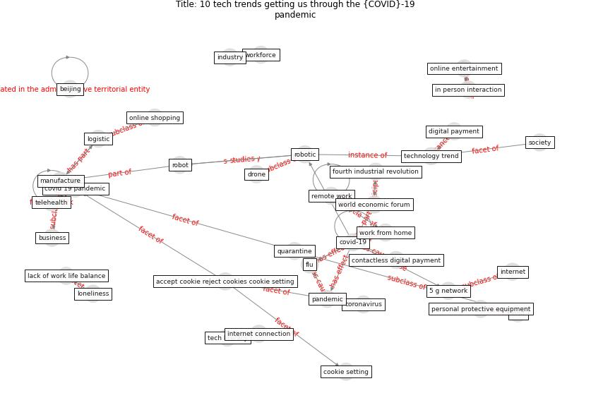

# Article: __10 tech trends getting us through the COVID-19 pandemic__ (yan_10_2020)

* URL: [https://www.weforum.org/agenda/2020/04/10-technology-trends-coronavirus-covid19-pandemic-robotics-telehealth/](https://www.weforum.org/agenda/2020/04/10-technology-trends-coronavirus-covid19-pandemic-robotics-telehealth/)
* Year: 2020
* Abstract: The coronavirus demonstrates the importance of – and the
challenges associated with – new technologies like
digital payments, telehealth and robotics.

## Keywords

* [cookie](keyword_cookie), [marketing cookie](keyword_marketing_cookie), [covid-19](keyword_covid-19), [pandemic](keyword_pandemic), [robot](keyword_robot), [reuter](keyword_reuter), [telehealth](keyword_telehealth), [manufacture](keyword_manufacture), [accept cookie reject cookies cookie setting](keyword_accept_cookie_reject_cookies_cookie_setting), [digital payment](keyword_digital_payment), [coronavirus](keyword_coronavirus), world economic forum, [cookie setting](keyword_cookie_setting), [robotic](keyword_robotic), [site](keyword_site)

## Keywords at large

* [biophilic design](keyword_biophilic_design), [architecture](keyword_architecture), [sustainable architecture](keyword_sustainable_architecture), [nature](keyword_nature), [design](keyword_design), [biophilic](keyword_biophilic), [environ](keyword_environ), [biophilia](keyword_biophilia), [wellbeing](keyword_wellbeing), [health](keyword_health)

## Concepts

 

