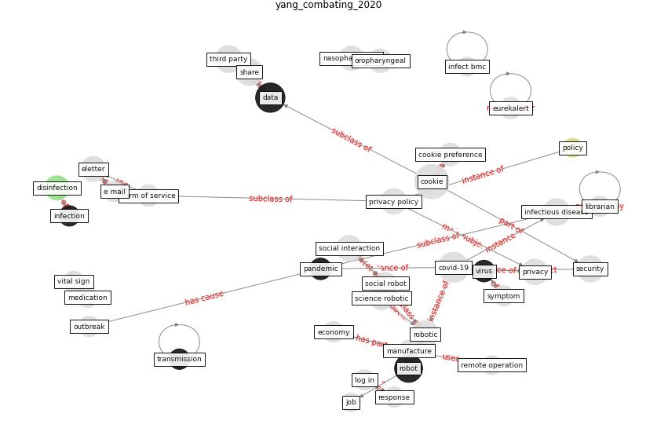

# Article: __Combating COVID-19—The role of robotics in managing public health and infectious diseases__ (yang_combating_2020)

* [10.1126/scirobotics.abb5589](https://doi.org/10.1126/scirobotics.abb5589)
* Cluster: [health-building](cluster_9)

## Keywords

* [covid-19](keyword_covid-19), [robot](keyword_robot), [infectious disease](keyword_infectious_disease), [robotic](keyword_robotic), [privacy](keyword_privacy), [social interaction](keyword_social_interaction), [privacy policy](keyword_privacy_policy), [eletter](keyword_eletter), [disinfection](keyword_disinfection), [nasopharyngeal](keyword_nasopharyngeal), oropharyngeal, science robotic, third party, [datum](keyword_datum), clinical care

## Keywords at large

* [covid-19](keyword_covid-19), [robot](keyword_robot), [robotic](keyword_robotic), [infectious disease](keyword_infectious_disease), [privacy](keyword_privacy), [privacy policy](keyword_privacy_policy), [social interaction](keyword_social_interaction), [eletter](keyword_eletter), [disinfection](keyword_disinfection), [nasopharyngeal](keyword_nasopharyngeal)

## Abstract

COVID-19 may drive sustained research in robotics to
address risks of infectious diseases. , COVID-19 may drive
sustained research in robotics to address risks of
infectious diseases.

## Concepts

 

### Closest articles 

* [Danish disinfection robots save lives in the fight against
the Corona virus \textbar Shaping Europe’s
digital future](article_ec_views_danish_2020)
* [Drones. Disinfecting robots. Supercomputers. The
coronavirus outbreak is a test for China's tech industry
\textbar CNN Business](article_wang_drones_2020)
* [Recently employed engineering techniques to reduce the spread of COVID-19 (corona virus disease 2019): a review study](article_saman_recently_2021)
* [10 tech trends getting us through the COVID-19
pandemic](article_yan_10_2020)
* [How drones help cities during the Covid-19 pandemic
\textbar TheMayor.EU](article_dimitrova_how_2021)
* [The socio-economic implications of the coronavirus pandemic (COVID-19): A review](article_nicola_socio-economic_2020)
* [A Comprehensive Review of the COVID-19 Pandemic and the Role of IoT, Drones, AI, Blockchain, and 5G in Managing its Impact](article_chamola_comprehensive_2020)
* [Borders and Catastrophe: lessons from COVID-19 for the European Green Deal](article_klein_borders_2021)
* [2020 Data Protection Report](article_council_of_europe_2020_2020)
* [Challenges of data sharing in European Covid-19 projects: A learning opportunity for advancing pandemic preparedness and response](article_tacconelli_challenges_2022)

