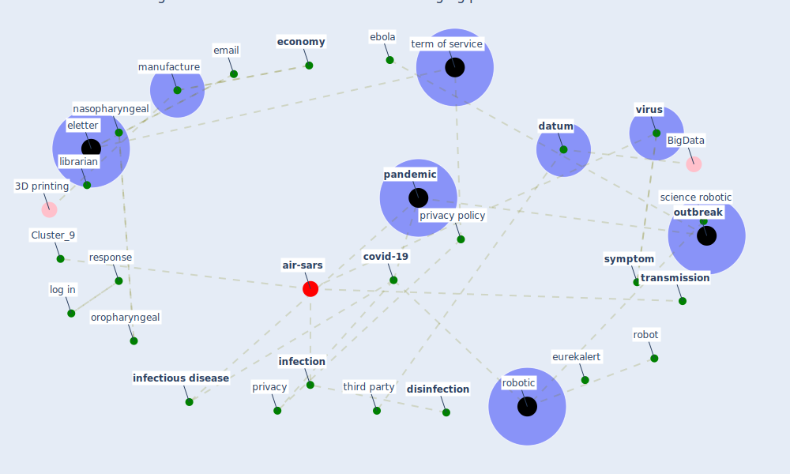

# Article: Combating COVID-19—The role of robotics in managing public health and infectious diseases (yang_combating_2020)

* Source: [10.1126/scirobotics.abb5589](https://doi.org/10.1126/scirobotics.abb5589)
* Year: 2020
* Cluster: [air-sars](cluster_9)

## Keywords

 * 10 1126 scirobotic, 2015 ebola outbreak, antibody, [application](keyword_application), automate camera, automate venepuncture, autonomous, blood, blood draw, blood test, conference, continuity of work, [control](keyword_control), covid 19 outbreak, [covid-19](keyword_covid-19), [datum](keyword_datum), [detection](keyword_detection), development, [disease](keyword_disease), [disinfection](keyword_disinfection), draw blood, drug delivery, ebola, [economy](keyword_economy), eissn, eletter, email, [epidemic](keyword_epidemic), eurekalert, european country, exhibition, globalization, ground vehicle, guang zhong yang, [health care](keyword_health_care), health care practitioner, hinari, human worker, infect bmc, [infection](keyword_infection), [infectious disease](keyword_infectious_disease), interconnect economy, italian, [italy](keyword_italy), job, laboratory test, librarian, log in, [manufacture](keyword_manufacture), microscale, mobile robot, nasopharyngeal, [news](keyword_news), news at a glance, next incident, oncimmune infectious disease, oropharyngeal, [outbreak](keyword_outbreak), outpatient, [pandemic](keyword_pandemic), patient contact, [policy](keyword_policy), practitioner, preventative measure, [privacy](keyword_privacy), [privacy policy](keyword_privacy_policy), proof of concept, px uv, remote operating power, remote operation, respiratory infectious disease, response, robin r nelson, robocap, [robot](keyword_robot), [robotic](keyword_robotic), robotic avatar, robotic system, rule, sample collection, science, science robotic, screen multiple people simultaneously, [security](keyword_security), swab, [symptom](keyword_symptom), telecommute, [telemedicine](keyword_telemedicine), teleoperation, temperature measurement, term of service, test, third party, toc, [transmission](keyword_transmission), [ultraviolet](keyword_ultraviolet), [uv light](keyword_uv_light), venipuncture, [virus](keyword_virus), voluntary quarantine

## Concepts

 

## Neighbours

### Closest articles

* Danish disinfection robots save lives in the fight against the Corona virus \textbar Shaping Europe’s digital future - [LINK](article_ec_views_danish_2020)
* Drones. Disinfecting robots. Supercomputers. The coronavirus outbreak is a test for China's tech industry \textbar CNN Business - [LINK](article_wang_drones_2020)
* COVID-19 could be a seasonal illness with higher risk in winter: Reduced humidity linked to increased COVID-19 risk - [LINK](article_university_of_sydney_covid-19_2020)
* China adapts survey drones to enforce world’s largest quarantine - [LINK](article_liu_china_2020)
* Mechanistic insights into the effect of humidity on airborne influenza virus survival, transmission and incidence - [LINK](article_marr_mechanistic_2019)
* Effects of temperature and humidity on the spread of COVID-19: A systematic review - [LINK](article_mecenas_effects_2020)
* Understanding the role of urban design in disease spreading - [LINK](article_brizuela_understanding_2019)
* How drones help cities during the Covid-19 pandemic \textbar TheMayor.EU - [LINK](article_dimitrova_how_2021)

### Closest BPs

* Blueprint: Monitoring of wastewater - [LINK](bp_21)
* Blueprint: Smart Locker System - [LINK](bp_1)
* Blueprint: Resilience in staffing and skills training - [LINK](bp_12)
