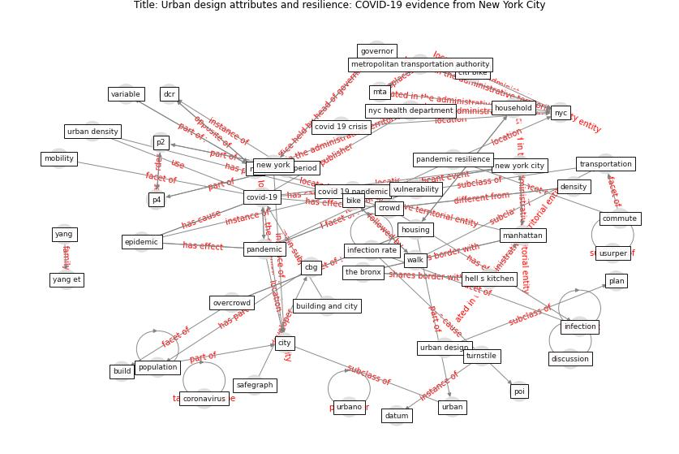

# Article: Urban design attributes and resilience: COVID-19 evidence from New York City (yang_urban_2021)

* Source: [10.5334/bc.130](https://doi.org/10.5334/bc.130)
* Year: 2021
* Cluster: [city-health](cluster_14)

## Keywords

 * atkinson center, bike, blake k s, [build](keyword_build), building and city, case rate, cbg, citi bike, [city](keyword_city), commute, commute time, cornell, cornell university, [coronavirus](keyword_coronavirus), [covid 19 crisis](keyword_covid_19_crisis), [covid 19 pandemic](keyword_covid_19_pandemic), [covid-19](keyword_covid-19), [crowd](keyword_crowd), [dataset](keyword_dataset), [datum](keyword_datum), dcr, density, discussion, [epidemic](keyword_epidemic), [epidemiology](keyword_epidemiology), exploratory variable, fij, first wave, governor, hell s kitchen, [household](keyword_household), household size, [housing](keyword_housing), income, [indoor](keyword_indoor), [inequality](keyword_inequality), [infection](keyword_infection), infection rate, introduction, kellerson r l, lockdown period, mag, [manhattan](keyword_manhattan), mappluto, mean, metropolitan transportation authority, mlr, [mobility](keyword_mobility), mta, multiple linear regression, national academies press, [neighborhood](keyword_neighborhood), [new york](keyword_new_york), [new york city](keyword_new_york_city), [nyc](keyword_nyc), nyc health department, nyc open datum, open space, overcrowd, p2, p4, [pandemic](keyword_pandemic), pandemic resilience, pandemic response, park, phase 1, [plan](keyword_plan), pluto, poi, [population](keyword_population), public health emergency, [resilience](keyword_resilience), safegraph, shopping mall, social science research network, sprawl, standard deviation, statacorp, statistic, statistical, subway, supermarket, system datum, the bronx, [transmission](keyword_transmission), transportation, turnstile, [united states](keyword_united_states), [urban](keyword_urban), urban density, urban design, urbano, usurper, variable, [vulnerability](keyword_vulnerability), walk, yang, yang et, zcta, zip code

## Concepts

 

## Neighbours

### Closest articles

* Association of built environment attributes with the spread of COVID-19 at its initial stage in China - [LINK](article_li_association_2021)
* Treating two pandemics for the price of one: Chronic and infectious disease impacts of the built and natural environment - [LINK](article_frank_treating_2021)
* Green in times of COVID-19: urban green space relevance during the COVID-19 pandemic in Buenos Aires City - [LINK](article_marconi_green_2022)
* Effects of the COVID-19 pandemic on the use and perceptions of urban green space: An international exploratory study - [LINK](article_ugolini_effects_2020)
* Assessment of COVID-19 precautionary measures in sports facilities: A case study on a health club in Saudi Arabia - [LINK](article_ibrahim_assessment_2022)
* COVID-19 Lockdown: Housing Built Environment’s Effects on Mental Health - [LINK](article_amerio_covid-19_2020)
* Home garden use during COVID-19: Associations with physical and mental wellbeing in older adults - [LINK](article_corley_home_2021)
* Urban Community Sustainable Development Patterns under the Influence of COVID-19: A Case Study Based on the Non-Contact Interaction Perspective of Hangzhou City - [LINK](article_wang_urban_2021)
* The socio-economic determinants of COVID-19: A spatial analysis of German county level data - [LINK](article_ehlert_socio-economic_2021)
* Green spaces, especially forest, linked to lower SARS-CoV-2 infection rates: A one-year nationwide study - [LINK](article_jiang_green_2021)

### Closest BPs

* Blueprint: Public places as information points - [LINK](bp_8)
* Blueprint: Architecture design - [LINK](bp_2)
* Blueprint: Tender support at building stage - [LINK](bp_9)
