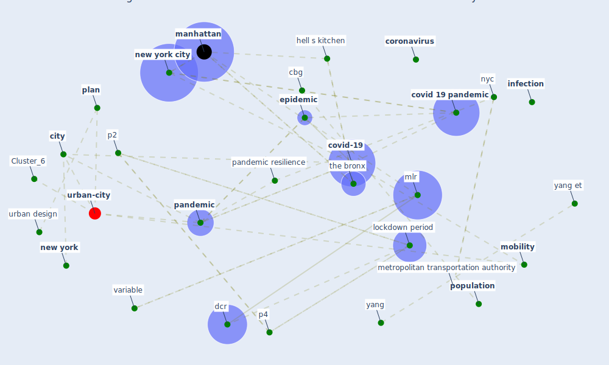

# Article: Urban design attributes and resilience: COVID-19 evidence from New York City (yang_urban_2021)

* Source: [10.5334/bc.130](https://doi.org/10.5334/bc.130)
* Year: 2021
* Cluster: [health-city](cluster_1)

## Keywords

 * atkinson center, bike, blake k s, [boston](keyword_boston), [build](keyword_build), building and city, case rate, cbg, [china](keyword_china), citi bike, [city](keyword_city), commute, commute time, cornell, cornell university, [coronavirus](keyword_coronavirus), [covid 19 crisis](keyword_covid_19_crisis), [covid 19 pandemic](keyword_covid_19_pandemic), [covid-19](keyword_covid-19), [crowd](keyword_crowd), [dataset](keyword_dataset), [datum](keyword_datum), dcr, [density](keyword_density), developer, discussion, [epidemic](keyword_epidemic), [epidemiology](keyword_epidemiology), exploratory variable, fij, first wave, governor, hell s kitchen, [household](keyword_household), household size, [housing](keyword_housing), income, [indoor](keyword_indoor), inequality, [infection](keyword_infection), infection rate, introduction, kellerson r l, lockdown period, mag, [manhattan](keyword_manhattan), mappluto, mean, metropolitan transportation authority, mlr, [mobility](keyword_mobility), mta, multiple linear regression, [neighborhood](keyword_neighborhood), [new york](keyword_new_york), [new york city](keyword_new_york_city), [nyc](keyword_nyc), nyc health department, nyc open datum, open space, overcrowd, p2, p4, [pandemic](keyword_pandemic), pandemic resilience, pandemic response, park, phase 1, [plan](keyword_plan), pluto, poi, [population](keyword_population), public health emergency, [resilience](keyword_resilience), safegraph, shopping mall, sprawl, spss, standard deviation, statacorp, statistical, subway, supermarket, the bronx, [transmission](keyword_transmission), [transportation](keyword_transportation), turnstile, [united states](keyword_united_states), [urban](keyword_urban), urban density, urban design, urbano, usurper, [variable](keyword_variable), [vulnerability](keyword_vulnerability), walk, yang, yang et, zcta, zip code

## Concepts

 

## Neighbours

### Closest articles

* Association of built environment attributes with the spread of COVID-19 at its initial stage in China - [LINK](article_li_association_2021)
* Understanding the role of urban design in disease spreading - [LINK](article_brizuela_understanding_2019)
* The City Under COVID‐19: Podcasting As Digital Methodology - [LINK](article_rogers_city_2020)
* Treating two pandemics for the price of one: Chronic and infectious disease impacts of the built and natural environment - [LINK](article_frank_treating_2021)
* The socio-economic determinants of COVID-19: A spatial analysis of German county level data - [LINK](article_ehlert_socio-economic_2021)
* 10 Adaptive Measures for Public Places to face the COVID 19 Pandemic Outbreak - [LINK](article_cheshmehzangi_10_2020)
* Eviction, Health Inequity, and the Spread of COVID-19: Housing Policy as a Primary Pandemic Mitigation Strategy - [LINK](article_benfer_eviction_2021)
* COVID-19 Lockdown: Housing Built Environment’s Effects on Mental Health - [LINK](article_amerio_covid-19_2020)
* Dangerous liaisons? Applying the social harm perspective to the social inequality, housing and health trifecta during the Covid-19 pandemic - [LINK](article_gurney_dangerous_2021)

### Closest BPs

* Blueprint: Resilience in staffing and skills training - [LINK](bp_12)
* Blueprint: Installing high-efficiency air filters - [LINK](bp_11)
* Blueprint: Air Cleaning Plants - [LINK](bp_15)
