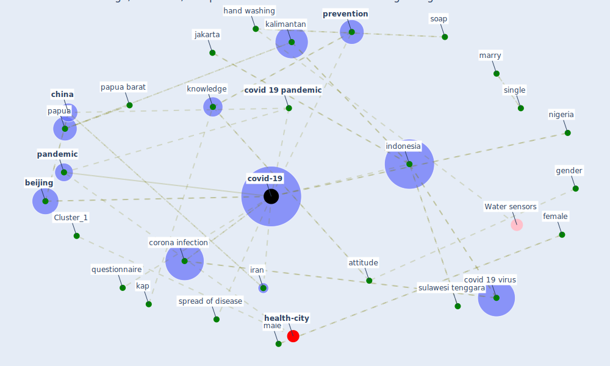

# Article: Knowledge, attitudes, and practices of Indonesian residents regarding COVID-19: A national cross-sectional survey (yodang_knowledge_2021)

* Source: [10.11591/ijphs.v10i2.20722](https://doi.org/10.11591/ijphs.v10i2.20722)
* Year: 2021
* Cluster: [respiratory-infection](cluster_3)

## Keywords

 * I don t know, age, [attitude](keyword_attitude), bali, bangladesh, [beijing](keyword_beijing), [child](keyword_child), [china](keyword_china), confirm, [corona](keyword_corona), corona infection, correlation analysis, covid 19 outbreak, [covid 19 pandemic](keyword_covid_19_pandemic), covid 19 prevention and mitigation practices, covid 19 virus, [covid-19](keyword_covid-19), covid19 virus, cross sectional, dhaka, ecuador, educate, employment status, ethiopia, female, frequency, gender, hand washing, healthc, [healthcare](keyword_healthcare), [hubei](keyword_hubei), hubei province, i agree n, i don t know n, i hasanoğlu, indigenous religions, individual, [indonesia](keyword_indonesia), [infection](keyword_infection), [infection control](keyword_infection_control), iran, islam, isolate, isolate infected patients, isolation, j j mol, j mol, jakarta, kalimantan, kap, [knowledge](keyword_knowledge), kolaka, male, maluku, marry, [mask](keyword_mask), mean, middle east, [mitigation](keyword_mitigation), [nigeria](keyword_nigeria), nusa tenggara kalimantan, ongoing research, [outbreak](keyword_outbreak), overseas, pakistan, [pandemic](keyword_pandemic), [papua](keyword_papua), papua barat, [participant](keyword_participant), pearson correlation test, [population](keyword_population), [prevention](keyword_prevention), [public health](keyword_public_health), questionnaire, r güner, republic of china, runny nose, [saudi arabia](keyword_saudi_arabia), [school](keyword_school), severe acute respiratory syndrome coronavirus 2, shiraz province, single, sneeze, soap, socio demographic, socio demographic characteristic, socio demographics, [spread](keyword_spread), spread of disease, standard deviation, sulawesi, sulawesi tenggara, sumatera, [symptom](keyword_symptom), tv, vol 13 no 7, [workplace](keyword_workplace), [wuhan](keyword_wuhan), y sitepu, young adult

## Concepts

 

## Neighbours

### Closest articles

* The impacts of knowledge, risk perception, emotion and information on citizens’ protective behaviors during the outbreak of COVID-19: a cross-sectional study in China - [LINK](article_ning_impacts_2020)
* COVID-19 media fatigue: predictors of decreasing interest and avoidance of COVID-19–related news - [LINK](article_buneviciene_covid-19_2021)
* Overview of the mitigation strategies for COVID-19 pandemic - [LINK](article_ads_overview_2020)
* Covid-19 and community mitigation strategies in a pandemic - [LINK](article_ebrahim_covid-19_2020)
* Infodemic and the spread of fake news in the COVID-19-era - [LINK](article_orso_infodemic_2020)
* Coronavirus disease 2019: The harms of exaggerated information and non‐evidence‐based measures - [LINK](article_ioannidis_coronavirus_2020)
* Contributions to the mitigation of the COVID-19 pandemic - [LINK](article_pilz_contributions_2022)
* Emergency Healthcare Facilities: Managing Design in a Post Covid-19 World - [LINK](article_marinelli_emergency_2020)
* Supporting Technologies for COVID-19 Prevention: Systemized Review - [LINK](article_zhao_supporting_2022)
* COVID-19 misinformation: Accuracy of articles about coronavirus prevention mostly shared on social media - [LINK](article_obiala_covid-19_2021)

### Closest BPs

* Blueprint: Resilience in staffing and skills training - [LINK](bp_12)
* Blueprint: Negative pressure rooms - [LINK](bp_13)
* Blueprint: Air Cleaning Plants - [LINK](bp_15)
