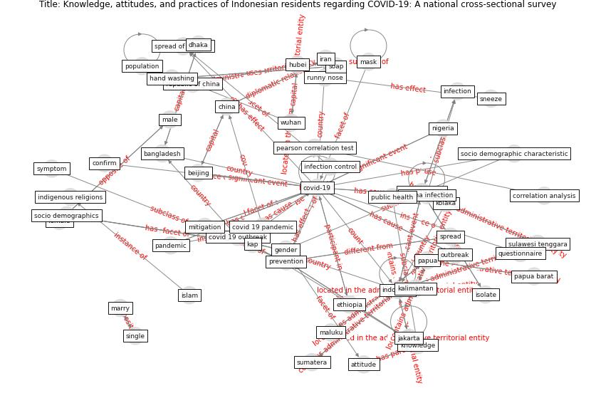

# Article: Knowledge, attitudes, and practices of Indonesian residents regarding COVID-19: A national cross-sectional survey (yodang_knowledge_2021)

* Source: [10.11591/ijphs.v10i2.20722](https://doi.org/10.11591/ijphs.v10i2.20722)
* Year: 2021
* Cluster: [city-health](cluster_14)

## Keywords

 * I don t know, age, [attitude](keyword_attitude), bali, bangladesh, [beijing](keyword_beijing), child, [china](keyword_china), confirm, [corona](keyword_corona), corona infection, correlation analysis, covid 19 outbreak, [covid 19 pandemic](keyword_covid_19_pandemic), covid 19 prevention and mitigation practices, covid 19 virus, [covid-19](keyword_covid-19), covid19 virus, cross sectional, dhaka, ecuador, educate, employment status, ethiopia, female, frequency, gender, hand washing, healthc, [healthcare](keyword_healthcare), [hubei](keyword_hubei), hubei province, i agree n, i don t know n, i hasanoğlu, indigenous religions, individual, [indonesia](keyword_indonesia), [infection](keyword_infection), [infection control](keyword_infection_control), iran, islam, isolate, isolate infected patients, isolation, j j mol, j mol, jakarta, kalimantan, kap, [knowledge](keyword_knowledge), kolaka, male, maluku, marry, [mask](keyword_mask), mean, middle east, [mitigation](keyword_mitigation), [nigeria](keyword_nigeria), nusa tenggara kalimantan, ongoing research, [outbreak](keyword_outbreak), overseas, pakistan, [pandemic](keyword_pandemic), [papua](keyword_papua), papua barat, participant, pearson correlation test, [population](keyword_population), prevention, [public health](keyword_public_health), questionnaire, r güner, republic of china, runny nose, [saudi arabia](keyword_saudi_arabia), [school](keyword_school), severe acute respiratory syndrome coronavirus 2, shiraz province, single, sneeze, soap, socio demographic, socio demographic characteristic, socio demographics, [spread](keyword_spread), spread of disease, standard deviation, sulawesi, sulawesi tenggara, sumatera, [symptom](keyword_symptom), tv, vol 13 no 7, [workplace](keyword_workplace), [wuhan](keyword_wuhan), y sitepu, young adult

## Concepts

 

## Neighbours

### Closest articles

* The impacts of knowledge, risk perception, emotion and information on citizens’ protective behaviors during the outbreak of COVID-19: a cross-sectional study in China - [LINK](article_ning_impacts_2020)
* Attitudes towards outdoor and neighbour noise during the COVID-19 lockdown: A case study in London - [LINK](article_lee_attitudes_2021)
* COVID-19 media fatigue: predictors of decreasing interest and avoidance of COVID-19–related news - [LINK](article_buneviciene_covid-19_2021)
* Public housing and COVID-19: contestation, challenge and change - [LINK](article_power_public_2020)
* Dangerous liaisons? Applying the social harm perspective to the social inequality, housing and health trifecta during the Covid-19 pandemic - [LINK](article_gurney_dangerous_2021)
* A Mixed Approach on Resilience of Spanish Dwellings and Households during COVID-19 Lockdown - [LINK](article_cuerdo-vilches_mixed_2020)
* Social distancing enhanced automated optimal design of physical spaces in the wake of the COVID-19 pandemic - [LINK](article_ugail_social_2021)
* Eviction, Health Inequity, and the Spread of COVID-19: Housing Policy as a Primary Pandemic Mitigation Strategy - [LINK](article_benfer_eviction_2021)
* Climate and the spread of COVID-19 - [LINK](article_chen_climate_2021)
* Study of COVID-19 pandemic in London (UK) from urban context - [LINK](article_ghosh_study_2020)

### Closest BPs

* Blueprint: Public places as information points - [LINK](bp_8)
* Blueprint: Air Cleaning Plants - [LINK](bp_15)
* Blueprint: Tender support at building stage - [LINK](bp_9)
