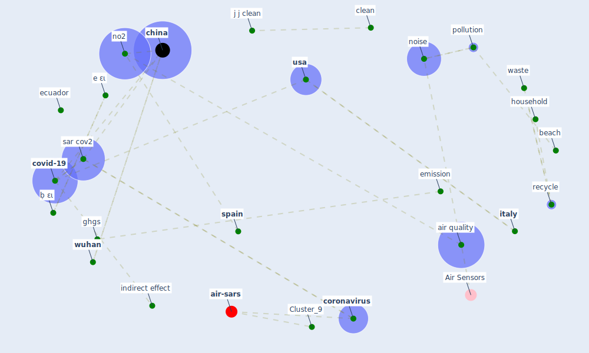

# Article: Indirect effects of COVID-19 on the environment (zambrano-monserrate_indirect_2020)

* Source: [10.1016/j.scitotenv.2020.138813](https://doi.org/10.1016/j.scitotenv.2020.138813)
* Year: 2020
* Cluster: [health-city](cluster_1)

## Keywords

 * a zambrano monserrate, [air pollution](keyword_air_pollution), air quality, an assessment tool for sandy beach, arcplus, asia, [barcelona](keyword_barcelona), beach, beach description, bull, carbonbudget, change in air pollution, [china](keyword_china), [clean](keyword_clean), clean beach, coffee, copernicus, copernicus atmosphere monitor service, [coronavirus](keyword_coronavirus), [country](keyword_country), [covid-19](keyword_covid-19), declaration of compete interest, decrease in ghg emission currently observedin some country, dobernig, e ει, [economy](keyword_economy), ecuador, [effect](keyword_effect), emission, engine performance, [environment](keyword_environment), [europe](keyword_europe), [european union](keyword_european_union), evolution of no2 concentration in china, food waste, food waste matter, get clean up, ghg emission, ghgs, [government](keyword_government), gözet, hazardous waste, [health](keyword_health), home delivery, [household](keyword_household), [hubei](keyword_hubei), hydrog, [impact](keyword_impact), [indirect effect](keyword_indirect_effect), indirect effect on the environment, inorganic, inorganic waste, [italy](keyword_italy), j j clean, j j hydrog, m a, m zambrano monserrate, manuelzambranom, municipal, no2, [noise](keyword_noise), noise level, objective conclusion, online shopping, organic, organic waste, [pollution](keyword_pollution), positive, private, public transportation, recreation, [recycle](keyword_recycle), recycle more, recycling center, resource consumption, restrict, reusable cup, ruano, [sar cov2](keyword_sar_cov2), self quarantine, sentinel5p, significantly, spagnolli a, [spain](keyword_spain), [sustainable](keyword_sustainable), [tourism](keyword_tourism), tourist, [transportation](keyword_transportation), un environment program, [usa](keyword_usa), varotto a, waste, waste management, waste more, wastemanagement, wastewater treatment plant, [wuhan](keyword_wuhan), wuhan province, zambrano monserrate, ḅ ει

## Concepts

 

## Neighbours

### Closest articles

* Nurture to nature via COVID-19, a self-regenerating environmental strategy of environment in global context - [LINK](article_paital_nurture_2020)
* Disinfection technology of hospital wastes and wastewater: Suggestions for disinfection strategy during coronavirus Disease 2019 (COVID-19) pandemic in China - [LINK](article_wang_disinfection_2020)
* Air pollution linked with higher COVID-19 death rates - [LINK](article_harvard_th_chan_schoold_of_public_health_air_2020)
* COVID-19 Higher Mortality in Chinese Regions With Chronic Exposure to Lower Air Quality - [LINK](article_pansini_covid-19_2021)
* Seeing the invisible hand: Underlying effects of COVID-19 on tourists’ behavioral patterns - [LINK](article_li_seeing_2020)
* Should I Stay or Should I Go? Tourists’ COVID-19 Risk Perception and Vacation Behavior Shift - [LINK](article_bratic_should_2021)
* The psychological impact of COVID-19 on the mental health in the general population - [LINK](article_serafini_psychological_2020)
* Psychological Effects of Home Confinement and Social Distancing Derived from COVID-19 in the General Population—A Systematic Review - [LINK](article_rodriguez-fernandez_psychological_2021)
* COVID-19 could be a seasonal illness with higher risk in winter: Reduced humidity linked to increased COVID-19 risk - [LINK](article_university_of_sydney_covid-19_2020)
* Climate and the spread of COVID-19 - [LINK](article_chen_climate_2021)

### Closest BPs

* Blueprint: Resilience in staffing and skills training - [LINK](bp_12)
* Blueprint: Installing UV in ductwork - [LINK](bp_10)
* Blueprint: Negative pressure rooms - [LINK](bp_13)
