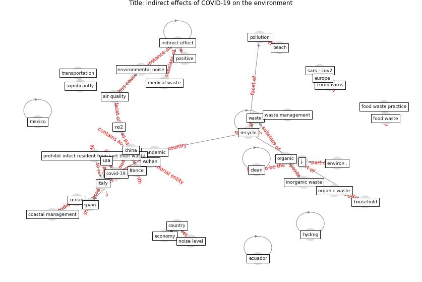

# Article: Indirect effects of COVID-19 on the environment (zambrano-monserrate_indirect_2020)

* Source: [10.1016/j.scitotenv.2020.138813](https://doi.org/10.1016/j.scitotenv.2020.138813)
* Year: 2020
* Cluster: [city-health](cluster_14)

## Keywords

 * a zambrano monserrate, [air pollution](keyword_air_pollution), air quality, arcplus, asia, [barcelona](keyword_barcelona), beach, beach description, bull, carbonbudget, change in air pollution, [china](keyword_china), [clean](keyword_clean), clean beach, copernicus atmosphere monitor service, [coronavirus](keyword_coronavirus), [country](keyword_country), [covid-19](keyword_covid-19), e ει, [economy](keyword_economy), ecuador, emission, engine performance, environmental noise, [europe](keyword_europe), [european union](keyword_european_union), evolution of no2 concentration in china, food waste matter, get clean up, ghg emission, ghgs, global economic activity, [government](keyword_government), gözet, hazardous waste, [health](keyword_health), home delivery, [household](keyword_household), [hubei](keyword_hubei), hydrog, [impact](keyword_impact), [indirect effect](keyword_indirect_effect), indirect effect on the environment, industrial facility, [italy](keyword_italy), j j clean, m a, m zambrano monserrate, manuelzambranom, medical waste, municipal, no2, [noise](keyword_noise), noise level, objective conclusion, [online shopping](keyword_online_shopping), organic, organic waste, [pandemic](keyword_pandemic), [personal protective equipment](keyword_personal_protective_equipment), pollution, positive, power plant, private, public transportation, ratification, recreation, [recycle](keyword_recycle), recycle more, recycling center, reduction of environmental noise level, resource consumption, reusable cup, rise, ruano, [sar cov2](keyword_sar_cov2), self quarantine, sentinel5p, significantly, [social](keyword_social), [social distancing](keyword_social_distancing), social distancing measure, spagnolli a, [spain](keyword_spain), [sustainable](keyword_sustainable), [tourism](keyword_tourism), tourist, transportation, un environment program, [usa](keyword_usa), varotto a, waste, waste management, waste more, waste recycling, wastemanagement, wastewater treatment plant, [wuhan](keyword_wuhan), zambrano monserrate, ḅ ει

## Concepts

 

## Neighbours

### Closest articles

* Nurture to nature via COVID-19, a self-regenerating environmental strategy of environment in global context - [LINK](article_paital_nurture_2020)
* Air pollution linked with higher COVID-19 death rates - [LINK](article_harvard_th_chan_schoold_of_public_health_air_2020)
* COVID-19 Higher Mortality in Chinese Regions With Chronic Exposure to Lower Air Quality - [LINK](article_pansini_covid-19_2021)
* Disinfection technology of hospital wastes and wastewater: Suggestions for disinfection strategy during coronavirus Disease 2019 (COVID-19) pandemic in China - [LINK](article_wang_disinfection_2020)
* China adapts survey drones to enforce world’s largest quarantine - [LINK](article_liu_china_2020)
* An environmental and health perspective for COVID-19 outbreak: Meteorology and air quality influence, sewage epidemiology indicator, hospitals disinfection, drug therapies and recommendations - [LINK](article_barcelo_environmental_2020)
* When the fourth water and digital revolution encountered COVID-19 - [LINK](article_poch_when_2020)
* Wastewater surveillance for population-wide Covid-19: The present and future - [LINK](article_daughton_wastewater_2020)
* SARS-CoV-2 in wastewater: potential health risk, but also data source - [LINK](article_lodder_sars-cov-2_2020)

### Closest BPs

* Blueprint: Monitoring of wastewater [CID] - [LINK](bp_21)
* Blueprint: Negative pressure rooms - [LINK](bp_13)
* Blueprint: Resilience in staffing and skills training - [LINK](bp_12)
