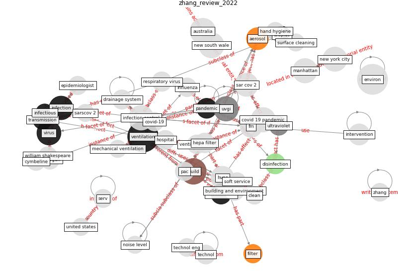

# Article: __A review of facilities management interventions to mitigate respiratory infections in existing buildings__ (zhang_review_2022)

* [10.1016/j.buildenv.2022.109347](https://doi.org/10.1016/j.buildenv.2022.109347)
* Cluster: [air-ventilation](cluster_8)

## Keywords

[ventilation](keyword_ventilation), [build](keyword_build), [virus](keyword_virus), [infection](keyword_infection)

## Concepts

 

### References 

* [How can airborne transmission of COVID-19 indoors be
minimised?](article_morawska_how_2020-1)
* [The effect of a redesigned floor plan, occupant density
and the quality of indoor climate on the cost of space,
productivity and sick leave in an office building–A
case study](article_saari_effect_2006)
* [Applications of ultraviolet germicidal irradiation
disinfection in health care facilities: Effective
adjunct, but not stand-alone technology](article_memarzadeh_applications_2010)
* [Designing Post COVID-19 Buildings: Approaches for
Achieving Healthy Buildings](article_navaratnam_designing_2022)
* [The effect of occupant distribution on energy consumption
and COVID-19 infection in buildings: A case study of
university building](article_mokhtari_effect_2021)
* [Ten questions concerning occupant health in buildings
during normal operations and extreme events including the
COVID-19 pandemic](article_awada_ten_2021)

### Cited by 

