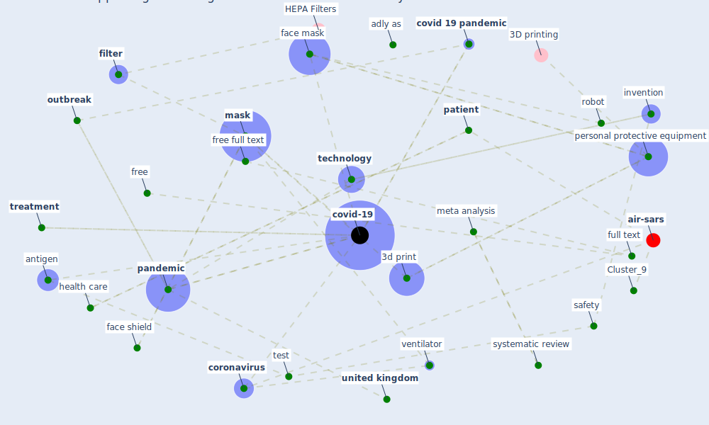

# Article: Supporting Technologies for COVID-19 Prevention: Systemized Review (zhao_supporting_2022)

* Source: [10.2196/30344](https://doi.org/10.2196/30344)
* Year: 2022
* Cluster: [air-sars](cluster_9)

## Keywords

 * [3d print](keyword_3d_print), additive manufacturing, adly as, antigen, antigen test, automation, bd veritor, cepheid, cepid, [company](keyword_company), corman vm, [coronavirus](keyword_coronavirus), [covid 19 pandemic](keyword_covid_19_pandemic), [covid-19](keyword_covid-19), delaware, developer, diagnostic test, [disease](keyword_disease), doctor, e smart ppe 2, end expiratory pressure, [epidemiological](keyword_epidemiological), ethic approval, f smart ppe 3, face mask, face shield, false negative, [filter](keyword_filter), free, free full text, full text, future, glangwili hospital, haage vc, half mask, [health care](keyword_health_care), health care worker, immunoassay, [infection](keyword_infection), invention, isolation, jmirx, jmirx me, kierkegaard p, labcorp, major contribution, maryland, [mask](keyword_mask), maskfone, medicine, medline, [meta analysis](keyword_meta_analysis), method, middle income country, [new york](keyword_new_york), news article, newspaper, nucleic acid, [nurse](keyword_nurse), [outbreak](keyword_outbreak), oxvent, palliative care, [pandemic](keyword_pandemic), paper, [patient](keyword_patient), [personal protective equipment](keyword_personal_protective_equipment), preventative measure, [prevention](keyword_prevention), protection, [public health](keyword_public_health), radbruch, renderx, [research](keyword_research), [researcher](keyword_researcher), rna, [robot](keyword_robot), rt pcr, [safety](keyword_safety), [sar cov 2](keyword_sar_cov_2), scientific report, self test, shield, sofia sar antigen fia, swennen, [symptom](keyword_symptom), systematic review, [technology](keyword_technology), test, testing, testing method, [transmission](keyword_transmission), [treatment](keyword_treatment), [united kingdom](keyword_united_kingdom), [united states](keyword_united_states), university of oxford, [ventilation](keyword_ventilation), [ventilator](keyword_ventilator), [virus](keyword_virus), xsl, zhao

## Concepts

 

## Neighbours

### Closest articles

* Response to COVID-19 in Taiwan - [LINK](article_wang_response_2020)
* Emergency Healthcare Facilities: Managing Design in a Post Covid-19 World - [LINK](article_marinelli_emergency_2020)
* Management of the COVID-19 pandemic: challenges, practices, and organizational support - [LINK](article_hossny_management_2022)
* Covid-19 and community mitigation strategies in a pandemic - [LINK](article_ebrahim_covid-19_2020)
* Overview of the mitigation strategies for COVID-19 pandemic - [LINK](article_ads_overview_2020)
* Coronavirus disease 2019: The harms of exaggerated information and non‐evidence‐based measures - [LINK](article_ioannidis_coronavirus_2020)
* COVID-ABS: An agent-based model of COVID-19 epidemic to simulate health and economic effects of social distancing interventions - [LINK](article_silva_covid-abs_2020)
* EXPOSED: An occupant exposure model for confined spaces to retrofit crowd models during a pandemic - [LINK](article_ronchi_exposed_2020)
* Knowledge, attitudes, and practices of Indonesian residents regarding COVID-19: A national cross-sectional survey - [LINK](article_yodang_knowledge_2021)

### Closest BPs

* Blueprint: Resilience in staffing and skills training - [LINK](bp_12)
* Blueprint: Air Cleaning Plants - [LINK](bp_15)
* Blueprint: Public places as information points - [LINK](bp_8)
