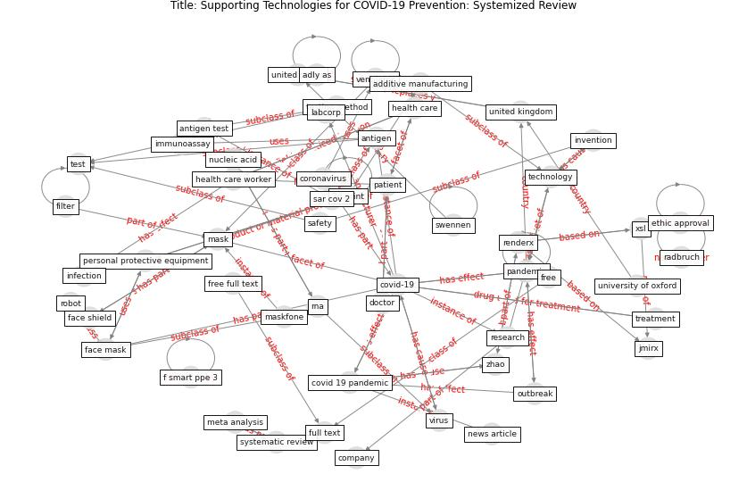

# Article: __Supporting Technologies for COVID-19 Prevention: Systemized Review__ (zhao_supporting_2022)

* [10.2196/30344](https://doi.org/10.2196/30344)
* Cluster: [health-building](cluster_9)

## Keywords

* [covid-19](keyword_covid-19), [ventilator](keyword_ventilator), [mask](keyword_mask), [pandemic](keyword_pandemic), [personal protective equipment](keyword_personal_protective_equipment), [health care](keyword_health_care), [full text](keyword_full_text), [covid 19 pandemic](keyword_covid_19_pandemic), [coronavirus](keyword_coronavirus), test, [united kingdom](keyword_united_kingdom), [patient](keyword_patient), [safety](keyword_safety), antigen test, [3d print](keyword_3d_print)

## Keywords at large

* [covid-19](keyword_covid-19), [ventilator](keyword_ventilator), [pandemic](keyword_pandemic), [mask](keyword_mask), [personal protective equipment](keyword_personal_protective_equipment), [health care](keyword_health_care), [3d print](keyword_3d_print), [full text](keyword_full_text), [covid 19 pandemic](keyword_covid_19_pandemic), [coronavirus](keyword_coronavirus)

## Abstract

Background During COVID-19, clinical and health care
demands have been on the rapid rise. Major challenges that
have arisen during the pandemic have included a lack of
testing kits, shortages of ventilators to treat severe
cases of COVID-19, and insufficient accessibility to
personal protective equipment for both hospitals and the
public. New technologies have been developed by scientists,
researchers, and companies in response to these demands.

Objective The primary objective of this review is to
compare different supporting technologies in the
subjugation of the COVID-19 spread.

Methods In this paper, 150 news articles and scientific
reports on COVID-19–related innovations during 2020-2021
were checked, screened, and shortlisted to yield a total of
23 articles for review. The keywords “COVID-19
technology,” “COVID-19 invention,” and “COVID-19
equipment” were used in a Google search to generate
related news articles and scientific reports. The search
was performed on February 1, 2021. These were then
categorized into three sections, which are personal
protective equipment (PPE), testing methods, and medical
treatments. Each study was analyzed for its engineering
characteristics and potential social impact on the COVID-19
pandemic.

Results A total of 9 articles were selected for review
concerning PPE. In general, the design and fabrication of
PPE were moving toward the direction of additive
manufacturing and intelligent information feedback while
being eco-friendly. Moreover, 8 articles were selected for
reviewing testing methods within the two main categories of
molecular and antigen tests. All the inventions endeavored
to increase sensitivity while reducing the turnaround time.
However, the inventions reported in this review paper were
not sufficiently tested for their safety and efficiency.
Most of the inventions are temporary solutions intended to
be used only during shortages of medical resources.
Finally, 6 articles were selected for the review of
COVID-19 medical treatment. The major challenge identified
was the uncertainty in applying novel ideas to speed up the
production of ventilators.

Conclusions The technologies developed during the COVID-19
pandemic were considered for review. In order to better
respond to future pandemics, national reserves of critical
medical supplies should be increased to improve
preparation. This pandemic has also highlighted the need
for the automation and optimization of medical
manufacturing.

## Concepts

 

### Closest articles 

* [Management of the COVID-19 pandemic: challenges, practices, and organizational support](article_hossny_management_2022)
* [COVID-19 Prevention and Control Measures in Workplace Settings: A Rapid Review and Meta-Analysis](article_ingram_covid-19_2021)
* [Physical interventions to interrupt or reduce the spread of respiratory viruses: systematic review](article_jefferson_physical_2008)
* [How Can Blockchain Help People in the Event of Pandemics Such as the COVID-19?](article_chang_how_2020)
* [Using Technology to Maintain the Education of Residents During the COVID-19 Pandemic](article_chick_using_2020)
* [COVID-19: A new digital dawn?](article_robbins_covid-19_2020)
* [Case Study on Finnish TVETA Resilient Model of
Training During COVID-19](article_unesco_case_2021)
* [The impact of climate change on the epidemiology and
control of Rift Valley fever - PubMed](article_martin_impact_2008)
* [Health Information Exchange with Blockchain amid Covid-19-like Pandemics](article_christodoulou_health_2020)
* [DeepSOCIAL: Social Distancing Monitoring and Infection Risk Assessment in COVID-19 Pandemic](article_rezaei_deepsocial_2020)

### References 

* [Combating COVID-19—The role of robotics in managing
public health and infectious diseases](article_yang_combating_2020)

### Cited by 

