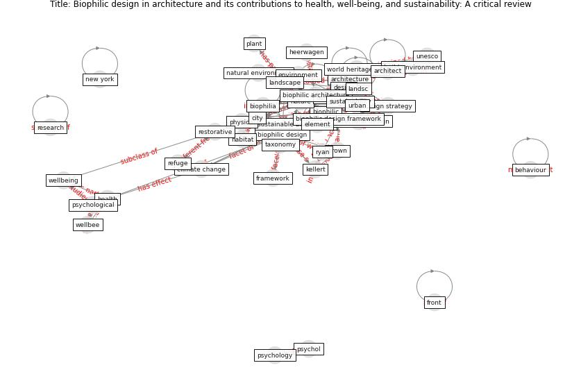

# Article: __Biophilic design in architecture and its contributions to health, well-being, and sustainability: A critical review__ (zhong_biophilic_2022)

* [10.1016/j.foar.2021.07.006](https://doi.org/10.1016/j.foar.2021.07.006)
* Cluster: [health-building](cluster_9)

## Keywords

* [biophilic design](keyword_biophilic_design), [architecture](keyword_architecture), [nature](keyword_nature), [sustainable architecture](keyword_sustainable_architecture), [design](keyword_design), [biophilic](keyword_biophilic), [biophilia](keyword_biophilia), [build](keyword_build), [health](keyword_health), [landscape](keyword_landscape), [wellbeing](keyword_wellbeing), [unesco](keyword_unesco), [world heritage site](keyword_world_heritage_site), [architect](keyword_architect), [psychol](keyword_psychol)

## Keywords at large

* [biophilic design](keyword_biophilic_design), [architecture](keyword_architecture), [sustainable architecture](keyword_sustainable_architecture), [nature](keyword_nature), [design](keyword_design), [biophilic](keyword_biophilic), [biophilia](keyword_biophilia), [build](keyword_build), [health](keyword_health), [architect](keyword_architect)

## Concepts

 

### Closest articles 

* [COVID-19 Lessons for a Resilient Built
Environment: A Roadmap](article_hull_covid-19_2020)
* [Navigating Climate Change: Rethinking the Role of Buildings](article_cole_navigating_2020)
* [COVID-19 Could Leverage a Sustainable Built Environment](article_pinheiro_covid-19_2020)
* [sarvari_global_2022-1](article_sarvari_global_2022-1)
* [A Global Survey of Infection Control and Mitigation Measures for Combating the Transmission of COVID-19 Pandemic in Buildings Under Facilities Management Services](article_sarvari_global_2022)
* [Antivirus-built environment: Lessons learned from Covid-19 pandemic](article_megahed_antivirus-built_2020)
* [The City Under COVID‐19: Podcasting As Digital Methodology](article_rogers_city_2020)
* [Revisiting the built environment: 10 potential development changes and paradigm shifts due to COVID-19](article_cheshmehzangi_revisiting_2021)
* [The Impact of COVID-19 on Public Space: A Review of the Emerging Questions](article_honey-roses_impact_2020)
* [Attitudes towards outdoor and neighbour noise during the COVID-19 lockdown: A case study in London](article_lee_attitudes_2021)

