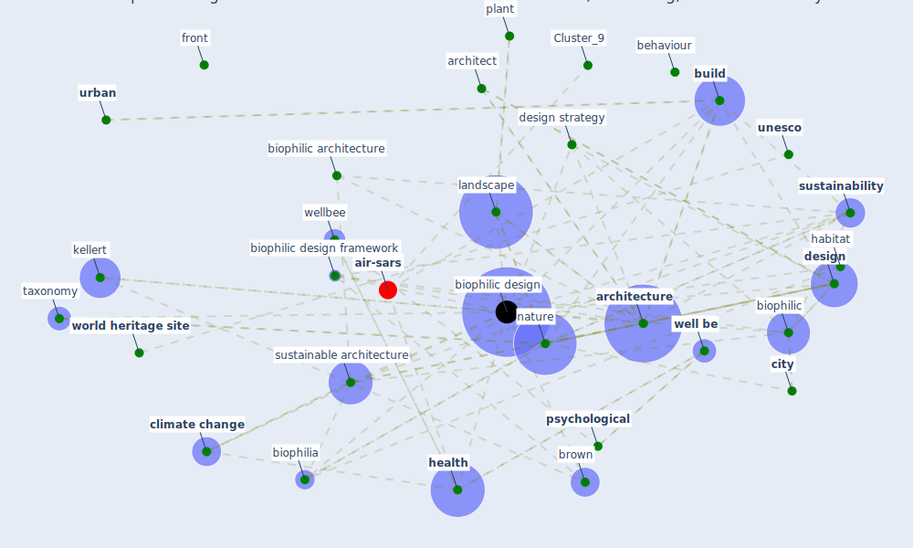

# Article: Biophilic design in architecture and its contributions to health, well-being, and sustainability: A critical review (zhong_biophilic_2022)

* Source: [10.1016/j.foar.2021.07.006](https://doi.org/10.1016/j.foar.2021.07.006)
* Year: 2022
* Cluster: [building-design](cluster_5)

## Keywords

 * [air pollution](keyword_air_pollution), [architect](keyword_architect), [architectural](keyword_architectural), [architecture](keyword_architecture), attention, attribute, back, behaviour, biophilia, biophilia hypothesis, [biophilic](keyword_biophilic), biophilic architecture, [biophilic design](keyword_biophilic_design), biophilic design framework, brown, [build](keyword_build), [build environment](keyword_build_environment), [building](keyword_building), building certificate, building to life, cambridge, cern, [city](keyword_city), [clean](keyword_clean), [climate change](keyword_climate_change), [community](keyword_community), concept, [construction](keyword_construction), controversy, [design](keyword_design), design element, design framework, design strategy, [dwell](keyword_dwell), ecosyst, element, emotion, [environment](keyword_environment), evolutionary history, evolutionary psychology, evolve, [experience](keyword_experience), framework, [france](keyword_france), front, [green](keyword_green), [green roof](keyword_green_roof), habitat, [health](keyword_health), heerwagen, hildebrand, human being, [impact](keyword_impact), [indoor](keyword_indoor), island press, kellert, landscape, life, live organism, ljubljana, [natural](keyword_natural), naturalistic, [nature](keyword_nature), [new york](keyword_new_york), paris, [physical](keyword_physical), place attachment, [plan](keyword_plan), [plant](keyword_plant), press, [psychological](keyword_psychological), [qualitative](keyword_qualitative), refuge, [research](keyword_research), restorative, ryan, savanna, scale, science, [sdgs](keyword_sdgs), [slovenia](keyword_slovenia), [stress](keyword_stress), survival, sustain, [sustainability](keyword_sustainability), [sustainable](keyword_sustainable), [sustainable architecture](keyword_sustainable_architecture), sustainable building, [sustainable development goal](keyword_sustainable_development_goal), [switzerland](keyword_switzerland), synthesis, taxonomy, uncertainty, [unesco](keyword_unesco), [urban](keyword_urban), urban architecture, [water](keyword_water), [well be](keyword_well_be), [wellbee](keyword_wellbee), [world heritage site](keyword_world_heritage_site)

## Concepts

 

## Neighbours

### Closest articles

* Disinfection technology of hospital wastes and wastewater: Suggestions for disinfection strategy during coronavirus Disease 2019 (COVID-19) pandemic in China - [LINK](article_wang_disinfection_2020)
* The socio-economic implications of the coronavirus pandemic (COVID-19): A review - [LINK](article_nicola_socio-economic_2020)
* Health, Economic and Social Development Challenges of the COVID-19 Pandemic: Strategies for Multiple and Interconnected Issues - [LINK](article_panneer_health_2022)
* Indirect effects of COVID-19 on the environment - [LINK](article_zambrano-monserrate_indirect_2020)
* The COVID-19 epidemiology and monitoring ontology - [LINK](article_queralt-rosinach_covid-19_2021)
* An Overview of Biomedical Ontologies for Pandemics and Infectious Diseases Representation - [LINK](article_bayoudhi_overview_2021)
* An Overview of Ontologies and Tool Support for COVID-19 Analytics - [LINK](article_ahmad_overview_2021)
* Nurture to nature via COVID-19, a self-regenerating environmental strategy of environment in global context - [LINK](article_paital_nurture_2020)
* The COVID-19 pandemic: Lessons on building more equal and sustainable societies - [LINK](article_van_barneveld_covid-19_2020)

### Closest BPs

* Blueprint: Resilience in staffing and skills training - [LINK](bp_12)
* Blueprint: Installing UV in ductwork - [LINK](bp_10)
* Blueprint: Monitoring of wastewater - [LINK](bp_21)
