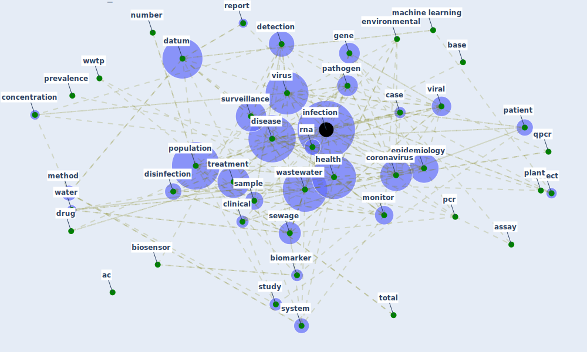

# Cluster: __wastewater-water__ (Cluster_0)

## Keywords

 * [ac](keyword_ac), [assay](keyword_assay), [base](keyword_base), [biomarker](keyword_biomarker), [biosensor](keyword_biosensor), [case](keyword_case), [clinical](keyword_clinical), [concentration](keyword_concentration), [coronavirus](keyword_coronavirus), [datum](keyword_datum), [detect](keyword_detect), [detection](keyword_detection), [disease](keyword_disease), [disinfection](keyword_disinfection), [drug](keyword_drug), [environmental](keyword_environmental), [epidemiology](keyword_epidemiology), [gene](keyword_gene), [health](keyword_health), [infection](keyword_infection), [machine learning](keyword_machine_learning), [marker](keyword_marker), [method](keyword_method), [monitor](keyword_monitor), [number](keyword_number), [pathogen](keyword_pathogen), [patient](keyword_patient), [pcr](keyword_pcr), [plant](keyword_plant), [pmc](keyword_pmc), [population](keyword_population), [prevalence](keyword_prevalence), [primer](keyword_primer), [qpcr](keyword_qpcr), [report](keyword_report), [rna](keyword_rna), [rt](keyword_rt), [sample](keyword_sample), [sewage](keyword_sewage), [study](keyword_study), [surveillance](keyword_surveillance), [system](keyword_system), [total](keyword_total), [treatment](keyword_treatment), [viral](keyword_viral), [virus](keyword_virus), [wastewater](keyword_wastewater), [water](keyword_water), [wwtp](keyword_wwtp)

## Concepts

 

# Linked articles

* First confirmed detection of SARS-CoV-2 in untreated wastewater in Australia: A proof of concept for the wastewater surveillance of COVID-19 in the community - [LINK](article_ahmed_first_2020)
* An environmental and health perspective for COVID-19 outbreak: Meteorology and air quality influence, sewage epidemiology indicator, hospitals disinfection, drug therapies and recommendations - [LINK](article_barcelo_environmental_2020)
* Wastewater-Based Epidemiology to monitor COVID-19 outbreak: Present and future diagnostic methods to be in your radar - [LINK](article_barcelo_wastewater-based_2020)
* Blueprint: Monitoring of wastewater - [LINK](bp_21)
* Computational analysis of SARS-CoV-2/COVID-19 surveillance by wastewater-based epidemiology locally and globally: Feasibility, economy, opportunities and challenges - [LINK](article_hart_computational_2020)
* First detection of SARS-CoV-2 in untreated wastewaters in Italy - [LINK](article_la_rosa_first_2020)
* SARS-CoV-2 in wastewater: potential health risk, but also data source - [LINK](article_lodder_sars-cov-2_2020)
* Presence of SARS-Coronavirus-2 RNA in Sewage and Correlation with Reported COVID-19 Prevalence in the Early Stage of the Epidemic in The Netherlands - [LINK](article_medema_presence_2020)
* When the fourth water and digital revolution encountered COVID-19 - [LINK](article_poch_when_2020)
* SARS-CoV-2 RNA in wastewater anticipated COVID-19 occurrence in a low prevalence area - [LINK](article_randazzo_sars-cov-2_2020)
* Future perspectives of wastewater-based epidemiology: Monitoring infectious disease spread and resistance to the community level - [LINK](article_sims_future_2020)
* Disinfection technology of hospital wastes and wastewater: Suggestions for disinfection strategy during coronavirus Disease 2019 (COVID-19) pandemic in China - [LINK](article_wang_disinfection_2020)
* Detection of SARS-CoV-2 in raw and treated wastewater in Germany – Suitability for COVID-19 surveillance and potential transmission risks - [LINK](article_westhaus_detection_2021)
* SARS-CoV-2 Titers in Wastewater Are Higher than Expected from Clinically Confirmed Cases - [LINK](article_wu_sars-cov-2_2020)
