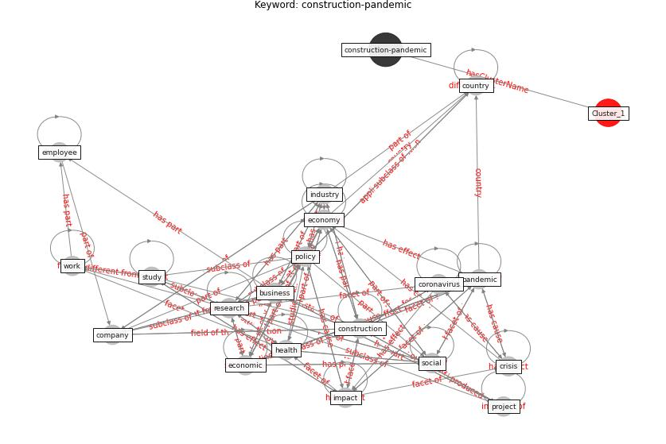

# Cluster: __datum-health__ (cluster1)
## Keywords

* [datum](keyword_datum), [health](keyword_health), [ai](keyword_ai), [blockchain](keyword_blockchain), [technology](keyword_technology), [patient](keyword_patient), [pandemic](keyword_pandemic), [coronavirus](keyword_coronavirus), [digital](keyword_digital), [medical](keyword_medical), [disease](keyword_disease), [taiwan](keyword_taiwan), [access](keyword_access), [application](keyword_application), [data](keyword_data), [robot](keyword_robot), [news](keyword_news), [case](keyword_case), [iot](keyword_iot), [virtual](keyword_virtual)

## Concepts

 

## Articles

* ostherr_telehealth_2020 ([ostherr_telehealth_2020](article_ostherr_telehealth_2020))
* Health Information Exchange with Blockchain amid
Covid-19-like Pandemics ([christodoulou_health_2020](article_christodoulou_health_2020))
* Supporting Technologies for COVID-19 Prevention:
Systemized Review ([zhao_supporting_2022](article_zhao_supporting_2022))
* tong_coronavirus_2020 ([tong_coronavirus_2020](article_tong_coronavirus_2020))
* Blockchain technology and its applications to combat
COVID-19 pandemic ([sharma_blockchain_2022](article_sharma_blockchain_2022))
* Infodemic and the spread of fake news in the
COVID-19-era ([orso_infodemic_2020](article_orso_infodemic_2020))
* A Comprehensive Review of the COVID-19 Pandemic
and the Role of IoT, Drones, AI, Blockchain, and
5G in Managing its Impact ([chamola_comprehensive_2020](article_chamola_comprehensive_2020))
* Combating COVID-19—The role of robotics in managing
public health and infectious diseases ([yang_combating_2020](article_yang_combating_2020))
* Recently employed engineering techniques to reduce the
spread of COVID-19 (corona virus disease 2019): a review
study ([saman_recently_2021](article_saman_recently_2021))
* realdania_pandemiens_2022 ([realdania_pandemiens_2022](article_realdania_pandemiens_2022))
* realdania_refleksioner_2022 ([realdania_refleksioner_2022](article_realdania_refleksioner_2022))
* Role of Information Technology in Covid-19
Prevention ([mehtab_alam_role_2021](article_mehtab_alam_role_2021))
* council_of_europe_2020_2020 ([council_of_europe_2020_2020](article_council_of_europe_2020_2020))
* Challenges of data sharing in European Covid-19
projects: A learning opportunity for advancing pandemic
preparedness and response ([tacconelli_challenges_2022](article_tacconelli_challenges_2022))
* Response to COVID-19 in Taiwan: Big Data
Analytics, New Technology, and Proactive
Testing ([wang_response_2020](article_wang_response_2020))
* Leveraging Digital Transformation Technologies to
Tackle COVID-19: Proposing a Privacy-First
Holistic Framework ([arpaci_leveraging_2021](article_arpaci_leveraging_2021))
* Emerging Technologies to Combat the COVID-19
Pandemic ([vaishya_emerging_2020](article_vaishya_emerging_2020))
* Significant applications of virtual reality for COVID-19
pandemic ([singh_significant_2020](article_singh_significant_2020))
* Design and Implementation of Entry-level COVID-19
Digital Signage Player supporting Fever
Detection, Face Mask Wearing Detection and
KI-pass QR Code Checking ([huy-tran_design_2022](article_huy-tran_design_2022))
* yan_10_2020 ([yan_10_2020](article_yan_10_2020))
* Internet of things (IoT) applications to fight against
COVID-19 pandemic ([singh_internet_2020](article_singh_internet_2020))
* Digital technology and COVID-19 ([ting_digital_2020](article_ting_digital_2020))
* wang_drones_2020 ([wang_drones_2020](article_wang_drones_2020))
* How Can Blockchain Help People in the Event of
Pandemics Such as the COVID-19? ([chang_how_2020](article_chang_how_2020))
* Mobile Technology Solution for COVID-19:
Surveillance and Prevention ([raza_mobile_2021](article_raza_mobile_2021))
* Pandemic Analytics: How Countries are Leveraging
Big Data Analytics and Artificial Intelligence to
Fight COVID-19? ([mehta_pandemic_2021](article_mehta_pandemic_2021))
* Exploring the Potential of Artificial Intelligence
and Machine Learning to Combat COVID-19 and
Existing Opportunities for LMIC: A Scoping
Review ([naseem_exploring_2020](article_naseem_exploring_2020))
* COVID-19: A new digital dawn? ([robbins_covid-19_2020](article_robbins_covid-19_2020))
