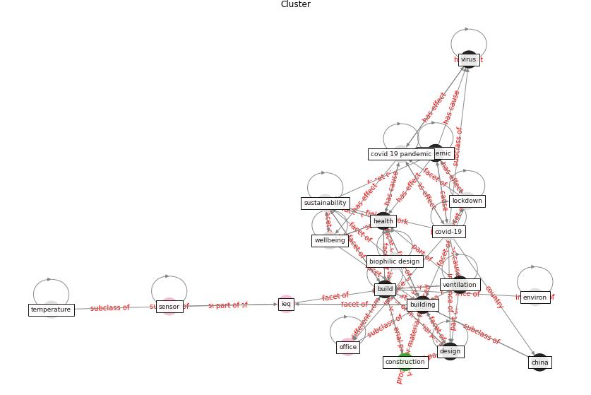

# Cluster: __building-health__ (cluster10)
## Keywords

* [building](keyword_building), [health](keyword_health), [ieq](keyword_ieq), [air](keyword_air), [office](keyword_office), [indoor](keyword_indoor), [system](keyword_system), [design](keyword_design), [work](keyword_work), [pandemic](keyword_pandemic), [environment](keyword_environment), [green](keyword_green), [occupant](keyword_occupant), [study](keyword_study), [mental](keyword_mental), [sensor](keyword_sensor), [space](keyword_space), [energy](keyword_energy), [build](keyword_build), [control](keyword_control)

## Concepts

 

## Articles

* A comprehensive review on indoor air quality monitoring
systems for enhanced public health ([saini_comprehensive_2020](article_saini_comprehensive_2020))
* hseie_algorithms_2021 ([hseie_algorithms_2021](article_hseie_algorithms_2021))
* Construction of a Linked Data Set of COVID-19
Knowledge Graphs: Development and Applications ([wang_construction_2022](article_wang_construction_2022))
* Architectural Design Drives the Biogeography of
Indoor Bacterial Communities ([kembel_architectural_2014](article_kembel_architectural_2014))
* cibse_emerging_202 ([cibse_emerging_202](article_cibse_emerging_202))
* Assessment of COVID-19 precautionary measures in sports
facilities: A case study on a health club in Saudi
Arabia ([ibrahim_assessment_2022](article_ibrahim_assessment_2022))
* How to Make Green Building Certification \&
Rating Systems More Pandemic-Sustainable? ([ujikawa_how_2022](article_ujikawa_how_2022))
* world_green_building_council_health_2014 ([world_green_building_council_health_2014](article_world_green_building_council_health_2014))
* harvard_th_chan_schoold_of_public_health_air_2020 ([harvard_th_chan_schoold_of_public_health_air_2020](article_harvard_th_chan_schoold_of_public_health_air_2020))
* COVID-19 and social inequalities: a complex and dynamic
interaction ([quantin_covid-19_2022](article_quantin_covid-19_2022))
* rozgus_will_2020 ([rozgus_will_2020](article_rozgus_will_2020))
* breeam_covid-19_2020 ([breeam_covid-19_2020](article_breeam_covid-19_2020))
* Ten questions concerning occupant health in buildings
during normal operations and extreme events including the
COVID-19 pandemic ([awada_ten_2021](article_awada_ten_2021))
* Biophilic design in architecture and its contributions to
health, well-being, and sustainability: A critical
review ([zhong_biophilic_2022](article_zhong_biophilic_2022))
* who_mental_2021 ([who_mental_2021](article_who_mental_2021))
* Navigating Climate Change: Rethinking the Role of
Buildings ([cole_navigating_2020](article_cole_navigating_2020))
* Reframe how to serve your community in the midst of a
pandemic ([sutton_reframe_2020](article_sutton_reframe_2020))
* How loneliness is talked about in social media during
COVID-19 pandemic: Text mining of 4,492 Twitter
feeds ([koh_how_2022](article_koh_how_2022))
* Design and Implementation of Entry-level COVID-19
Digital Signage Player supporting Fever
Detection, Face Mask Wearing Detection and
KI-pass QR Code Checking ([huy-tran_design_2022](article_huy-tran_design_2022))
* afp_rotating_2021 ([afp_rotating_2021](article_afp_rotating_2021))
* A Global Survey of Infection Control and
Mitigation Measures for Combating the Transmission
of COVID-19 Pandemic in Buildings Under
Facilities Management Services ([sarvari_global_2022](article_sarvari_global_2022))
* An Intelligent IEQ Monitoring and Feedback
System: Development and Applications ([geng_intelligent_2021](article_geng_intelligent_2021))
* Assessment method for new sustainability indicators
providing pandemic resilience for residential buildings ([tokazhanov_assessment_2021](article_tokazhanov_assessment_2021))
* COVID-19 Experience Transforming the Protective
Environment of Office Buildings and Spaces ([phapant_covid-19_2021](article_phapant_covid-19_2021))
* Assessment of Building Automation and Control
Systems in Danish Healthcare Facilities in the
COVID-19 Era ([pedersen_assessment_2022](article_pedersen_assessment_2022))
* lam_smart_2021 ([lam_smart_2021](article_lam_smart_2021))
* Continuous IEQ monitoring system: Context and
development ([parkinson_continuous_2019](article_parkinson_continuous_2019))
* hmc_architects_how_2020 ([hmc_architects_how_2020](article_hmc_architects_how_2020))
* Occupant health in buildings: Impact of the COVID-19
pandemic on the opinions of building professionals and
implications on research ([awada_occupant_2022](article_awada_occupant_2022))
* pricewaterhousecoopers_its_2021 ([pricewaterhousecoopers_its_2021](article_pricewaterhousecoopers_its_2021))
* world_green_building_council_contribution_2020 ([world_green_building_council_contribution_2020](article_world_green_building_council_contribution_2020))
* Readiness Assessment of Green Building
Certification Systems for Residential Buildings
during Pandemics ([tleuken_readiness_2021](article_tleuken_readiness_2021))
* Home garden use during COVID-19: Associations with
physical and mental wellbeing in older adults ([corley_home_2021](article_corley_home_2021))
* Using Technology to Maintain the Education of
Residents During the COVID-19 Pandemic ([chick_using_2020](article_chick_using_2020))
* The effect of a redesigned floor plan, occupant density
and the quality of indoor climate on the cost of space,
productivity and sick leave in an office building–A
case study ([saari_effect_2006](article_saari_effect_2006))
* hull_covid-19_2020 ([hull_covid-19_2020](article_hull_covid-19_2020))
* sarvari_global_2022-1 ([sarvari_global_2022-1](article_sarvari_global_2022-1))
* Green Buildings: A Post COVID-19 Analysis of
Preventive Measures of Spreading the Virus ([yakubu_aminu_dodo_green_2020](article_yakubu_aminu_dodo_green_2020))
* davalos_how_2021 ([davalos_how_2021](article_davalos_how_2021))
* Building occupancy estimation with people flow modeling in
AnyLogic ([li_building_2016](article_li_building_2016))
* cibse_emerging_2020 ([cibse_emerging_2020](article_cibse_emerging_2020))
* Scalable IoT Architecture for Monitoring IEQ
Conditions in Public and Private Buildings ([calvo_scalable_2022](article_calvo_scalable_2022))
* A study on office workplace modification during the
COVID-19 pandemic in The Netherlands ([hou_study_2021](article_hou_study_2021))
* Occupants’ behavior and activity patterns influencing
the energy consumption in the Kuwaiti residences ([al-mumin_occupants_2003](article_al-mumin_occupants_2003))
* Management of the COVID-19 pandemic: challenges,
practices, and organizational support ([hossny_management_2022](article_hossny_management_2022))
* Attitudes towards outdoor and neighbour noise during the
COVID-19 lockdown: A case study in London ([lee_attitudes_2021](article_lee_attitudes_2021))
* Assessing the health and hygiene performance of apartment
buildings ([ho_assessing_2004](article_ho_assessing_2004))
* Mental health economics: A prospective study on
psychological flourishing and associations with healthcare
costs and sickness benefit transfers in Denmark ([santini_mental_2021](article_santini_mental_2021))
* Eviction, Health Inequity, and the Spread of
COVID-19: Housing Policy as a Primary Pandemic
Mitigation Strategy ([benfer_eviction_2021](article_benfer_eviction_2021))
