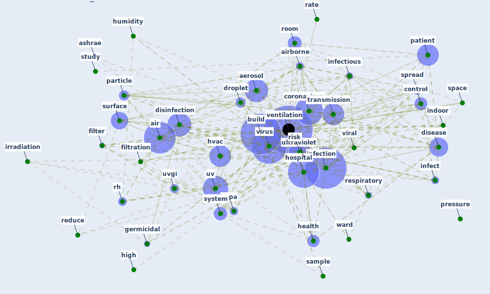

# Cluster: __air-uv__ (Cluster_10)

## Keywords

 * [aerosol](keyword_aerosol), [air](keyword_air), [airborne](keyword_airborne), [ashrae](keyword_ashrae), [build](keyword_build), [conditioning](keyword_conditioning), [control](keyword_control), [coronavirus](keyword_coronavirus), [disease](keyword_disease), [disinfection](keyword_disinfection), [droplet](keyword_droplet), [filter](keyword_filter), [filtration](keyword_filtration), [germicidal](keyword_germicidal), [health](keyword_health), [hepa](keyword_hepa), [high](keyword_high), [hospital](keyword_hospital), [humidity](keyword_humidity), [hvac](keyword_hvac), [indoor](keyword_indoor), [infect](keyword_infect), [infection](keyword_infection), [infectious](keyword_infectious), [irradiation](keyword_irradiation), [particle](keyword_particle), [patient](keyword_patient), [pressure](keyword_pressure), [rate](keyword_rate), [reduce](keyword_reduce), [respiratory](keyword_respiratory), [rh](keyword_rh), [risk](keyword_risk), [room](keyword_room), [sample](keyword_sample), [space](keyword_space), [spread](keyword_spread), [study](keyword_study), [surface](keyword_surface), [system](keyword_system), [transmission](keyword_transmission), [ultraviolet](keyword_ultraviolet), [upper](keyword_upper), [uv](keyword_uv), [uvgi](keyword_uvgi), [ventilation](keyword_ventilation), [viral](keyword_viral), [virus](keyword_virus), [ward](keyword_ward)

## Concepts

 

# Linked articles

* ASHRAE Position Document on Infectious Aerosols - [LINK](article_ashrae_ashrae_2022)
* Behind the Update: ASHRAE Handbook Chapters on UV-C to Include Updated Best Practices, Guidance - [LINK](article_ashrae_behind_2020)
* Environmental factors involved in SARS-CoV-2 transmission: effect and role of indoor environmental quality in the strategy for COVID-19 infection control - [LINK](article_azuma_environmental_2020)
* Efficacy of an Automated Multiple Emitter Whole-Room Ultraviolet-C Disinfection System Against Coronaviruses MHV and MERS-CoV - [LINK](article_bedell_efficacy_2016)
* Upper-room ultraviolet air disinfection might help to reduce COVID-19 transmission in buildings: a feasibility study - [LINK](article_beggs_upper-room_2020)
* Methods for air cleaning and protection of building occupants from airborne pathogens - [LINK](article_bolashikov_methods_2009)
* Blueprint: Installing UV in ductwork - [LINK](bp_10)
* Blueprint: Installing high-efficiency air filters - [LINK](bp_11)
* Blueprint: Negative pressure rooms - [LINK](bp_13)
* Far-UVC light (222 nm) efficiently and safely inactivates airborne human coronaviruses - [LINK](article_buonanno_far-uvc_2020)
* The ventilation of buildings and other mitigating measures for COVID-19: a focus on wintertime - [LINK](article_burridge_ventilation_2021)
* COVID-19 Pandemic: Prevention and Protection Measures to Be Adopted at the Workplace - [LINK](article_cirrincione_covid-19_2020)
* The removal of airborne SARS-CoV-2 and other microbial bioaerosols by air filtration on COVID-19 surge units - [LINK](article_conway-morris_removal_2021)
* 2019 Novel Coronavirus (COVID-19) Pandemic: Built Environment Considerations To Reduce Transmission - [LINK](article_dietz_2019_2020)
* Toilets dominate environmental detection of SARS-CoV-2 virus in a hospital - [LINK](article_ding_toilets_2020)
* COVID-19 Forced Hospitals to Build Negative Pressure Rooms Fast - [LINK](article_dyer_covid-19_2020)
* Heating, ventilation and air-conditioning systems in the context of COVID-19 - [LINK](article_ecdc_heating_2020)
* A critical review of heating, ventilation, and air conditioning (HVAC) systems within the context of a global SARS-CoV-2 epidemic - [LINK](article_elsaid_critical_2021)
* Upper-Room Ultraviolet Light and Negative Air Ionization to Prevent Tuberculosis Transmission - [LINK](article_escombe_upper-room_2009)
* Aerosol and Surface Distribution of Severe Acute Respiratory Syndrome Coronavirus 2 in Hospital Wards, Wuhan, China, 2020 - [LINK](article_guo_aerosol_2020)
* Review and comparison of HVAC operation guidelines in different countries during the COVID-19 pandemic - [LINK](article_guo_review_2021)
* Case Study: Using Germicidal UV-C to Mitigate COVID-19 - HVAC - [LINK](article_healthcare_facilities_today_case_2021)
* The Effect of Opening Windows on Air Change Rates in Two Homes - [LINK](article_howard-reed_effect_2002)
* COVID-19 and its Modes of Transmission - [LINK](article_karia_covid-19_2020)
* Rapid expansion of temporary, reliable airborne-infection isolation rooms with negative air machines for critical COVID-19 patients - [LINK](article_lee_rapid_2020)
* Mechanistic insights into the effect of humidity on airborne influenza virus survival, transmission and incidence - [LINK](article_marr_mechanistic_2019)
* Indoor Air Quality: Rethinking rules of building design strategies in post-pandemic architecture - [LINK](article_megahed_indoor_2021)
* Applications of ultraviolet germicidal irradiation disinfection in health care facilities: Effective adjunct, but not stand-alone technology - [LINK](article_memarzadeh_applications_2010)
* How can airborne transmission of COVID-19 indoors be minimised? - [LINK](article_morawska_how_2020)
* Air Disinfection for Airborne Infection Control with a Focus on COVID‐19: Why Germicidal UV is Essential             † - [LINK](article_nardell_air_2021)
* Ventilation use in nonmedical settings during COVID-19: Cleaning protocol, maintenance, and recommendations - [LINK](article_nembhard_ventilation_2020)
* Air, Surface Environmental, and Personal Protective Equipment Contamination by Severe Acute Respiratory Syndrome Coronavirus 2 (SARS-CoV-2) From a Symptomatic Patient - [LINK](article_ong_air_2020)
* The efficacy of social distance and ventilation effectiveness in preventing COVID-19 transmission - [LINK](article_sun_efficacy_2020)
* Real-world data show that filters clean COVID-causing virus from air - [LINK](article_thompson_real-world_2021)
* Effect of Ultraviolet Germicidal Irradiation on Viral Aerosols - [LINK](article_walker_effect_2007)
* Characterization and performance evaluation of a full-scale activated carbon-based dynamic botanical air filtration system for improving indoor air quality - [LINK](article_wang_characterization_2011)
* SARS-CoV-2 RNA detection of hospital isolation wards hygiene monitoring during the Coronavirus Disease 2019 outbreak in a Chinese hospital - [LINK](article_wang_sars-cov-2_2020)
* A review of facilities management interventions to mitigate respiratory infections in existing buildings - [LINK](article_zhang_review_2022)
