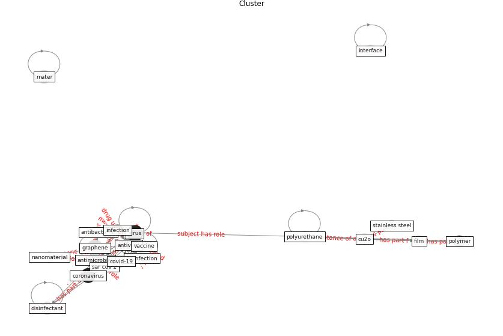

# Cluster: __mental-health__ (Cluster_11)

## Keywords

 * [anxiety](keyword_anxiety), [class](keyword_class), [depression](keyword_depression), [emotional](keyword_emotional), [fitness](keyword_fitness), [garden](keyword_garden), [gym](keyword_gym), [health](keyword_health), [mental](keyword_mental), [pandemic](keyword_pandemic), [people](keyword_people), [physical](keyword_physical), [psychological](keyword_psychological), [psychosocial](keyword_psychosocial), [ptsd](keyword_ptsd), [sleep](keyword_sleep), [stress](keyword_stress), [substance](keyword_substance), [team](keyword_team), [year](keyword_year)

## Concepts

 

# Linked articles

* Home garden use during COVID-19: Associations with physical and mental wellbeing in older adults - [LINK](article_corley_home_2021)
* How Covid-19 Has Permanently Changed the Fitness Industry - [LINK](article_davalos_how_2021)
* Mental Health and the Covid-19 Pandemic - [LINK](article_pfefferbaum_mental_2020)
* Psychological Effects of Home Confinement and Social Distancing Derived from COVID-19 in the General Population—A Systematic Review - [LINK](article_rodriguez-fernandez_psychological_2021)
* Mental health and COVID-19 - [LINK](article_who_mental_2021)
