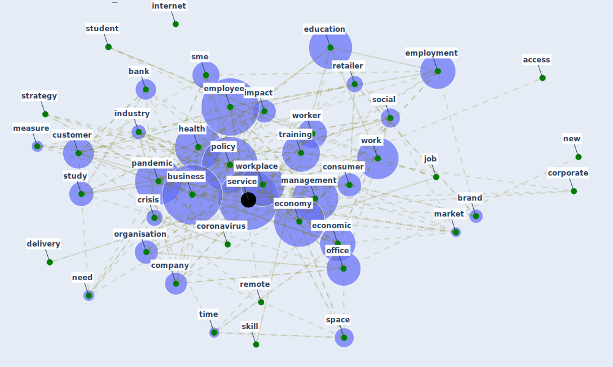

# Cluster: __business-customer__ (Cluster_11)

## Keywords

 * [access](keyword_access), [bank](keyword_bank), [brand](keyword_brand), [business](keyword_business), [company](keyword_company), [consumer](keyword_consumer), [coronavirus](keyword_coronavirus), [corporate](keyword_corporate), [crisis](keyword_crisis), [customer](keyword_customer), [delivery](keyword_delivery), [economic](keyword_economic), [economy](keyword_economy), [education](keyword_education), [employee](keyword_employee), [employment](keyword_employment), [flexible](keyword_flexible), [health](keyword_health), [impact](keyword_impact), [industry](keyword_industry), [internet](keyword_internet), [job](keyword_job), [labour](keyword_labour), [locker](keyword_locker), [make](keyword_make), [management](keyword_management), [market](keyword_market), [measure](keyword_measure), [need](keyword_need), [new](keyword_new), [office](keyword_office), [organisation](keyword_organisation), [pandemic](keyword_pandemic), [policy](keyword_policy), [remote](keyword_remote), [retailer](keyword_retailer), [service](keyword_service), [skill](keyword_skill), [sme](keyword_sme), [social](keyword_social), [space](keyword_space), [strategy](keyword_strategy), [student](keyword_student), [study](keyword_study), [time](keyword_time), [training](keyword_training), [work](keyword_work), [worker](keyword_worker), [workplace](keyword_workplace)

## Concepts

 

# Linked articles

* Blueprint: Smart Locker System - [LINK](bp_1)
* Blueprint: Resilience in staffing and skills training - [LINK](bp_12)
* Touchless Retail: What the Rest of the World could learn from China’s new ways to shop - [LINK](article_capgemini_touchless_2020)
* The COVID-19 Impact on Flexible Office Space - [LINK](article_clifton_covid-19_2020)
* Sustainable work throughout the life course: National policies and strategies, Publications Office of the European Union - [LINK](article_eurofund_sustainable_2016)
* A study on office workplace modification during the COVID-19 pandemic in The Netherlands - [LINK](article_hou_study_2021)
* KIX to apply antimicrobial coating in its fight against COVID-19 - [LINK](article_kansai_airport_kix_2021)
* Startups in times of crisis – A rapid response to the COVID-19 pandemic - [LINK](article_kuckertz_startups_2020)
* COVID-19 and the UN Sustainable Development Goals: Threat to Solidarity or an Opportunity? - [LINK](article_leal_filho_covid-19_2020)
* Retail Signage During the COVID-19 Pandemic - [LINK](article_mcneish_retail_2020)
* The socio-economic implications of the coronavirus pandemic (COVID-19): A review - [LINK](article_nicola_socio-economic_2020)
* It’s time to reimagine where and how work will get done (PwC’s US Remote Work Survey) - [LINK](article_pricewaterhousecoopers_its_2021)
* COVID-19 and regional solutions for mitigating the risk of SME finance in selected ASEAN member states - [LINK](article_taghizadeh-hesary_covid-19_2022)
* <scp>COVID</scp>             ‐19: Small and medium enterprises challenges and responses with creativity, innovation, and entrepreneurship - [LINK](article_thukral_covid19_2021)
* Case Study on Finnish TVETA Resilient Model of Training During COVID-19 - [LINK](article_unesco_case_2021)
* The COVID-19 pandemic: Lessons on building more equal and sustainable societies - [LINK](article_van_barneveld_covid-19_2020)
* How COVID-19 Could Accelerate the Adoption of New Retail Technologies and Enhance the (E-)Servicescape - [LINK](article_willems_how_2021)
* World Bank Development Report - [LINK](article_world_bank_world_2022)
* 10 tech trends getting us through the COVID-19 pandemic - [LINK](article_yan_10_2020)
