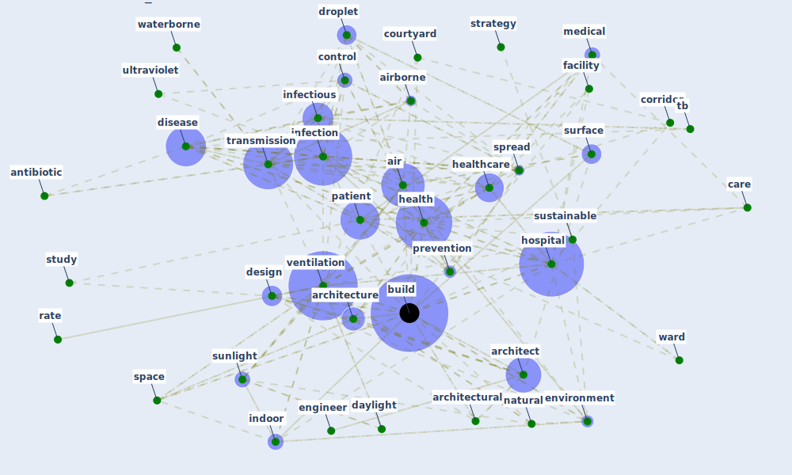

# Cluster: __design-ventilation__ (Cluster_12)

## Keywords

 * [air](keyword_air), [airborne](keyword_airborne), [antibiotic](keyword_antibiotic), [architect](keyword_architect), [architectural](keyword_architectural), [architecture](keyword_architecture), [build](keyword_build), [build](keyword_build), [buildings](keyword_buildings), [care](keyword_care), [control](keyword_control), [corridor](keyword_corridor), [courtyard](keyword_courtyard), [daylight](keyword_daylight), [design](keyword_design), [disease](keyword_disease), [droplet](keyword_droplet), [engineer](keyword_engineer), [environment](keyword_environment), [facility](keyword_facility), [health](keyword_health), [healthcare](keyword_healthcare), [hospital](keyword_hospital), [indoor](keyword_indoor), [infection](keyword_infection), [infectious](keyword_infectious), [ipc](keyword_ipc), [lessen](keyword_lessen), [medical](keyword_medical), [mm](keyword_mm), [natural](keyword_natural), [nightingale](keyword_nightingale), [patient](keyword_patient), [pavilion](keyword_pavilion), [prevention](keyword_prevention), [rate](keyword_rate), [space](keyword_space), [spread](keyword_spread), [strategy](keyword_strategy), [study](keyword_study), [sunlight](keyword_sunlight), [surface](keyword_surface), [sustainable](keyword_sustainable), [tb](keyword_tb), [transmission](keyword_transmission), [ultraviolet](keyword_ultraviolet), [ventilation](keyword_ventilation), [ward](keyword_ward), [waterborne](keyword_waterborne)

## Concepts

 

# Linked articles

* A Review on Building Design as a Biomedical System for Preventing COVID-19 Pandemic - [LINK](article_amran_review_2022)
* Architectural design strategies for infection prevention and control (IPC) in health-care facilities: towards curbing the spread of Covid-19 \textbar SpringerLink - [LINK](article_udomiaye_architectural_2020)
